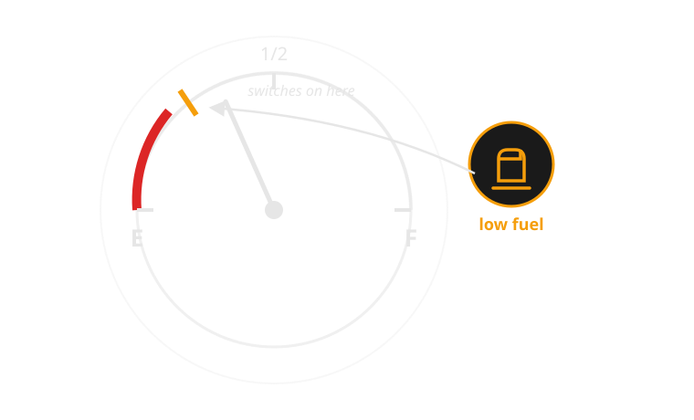
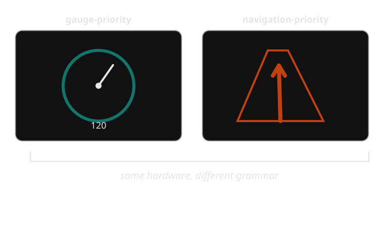
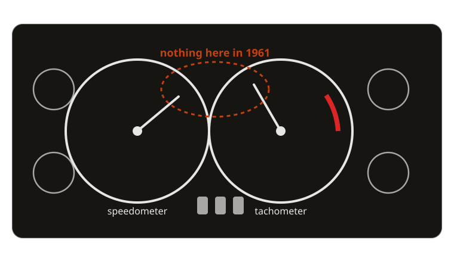

{/* _class: impact */}

# Week 1 — The Dashboard as Language

## What is a dashboard actually saying, to whom, and under what constraint?

Twelve weeks studying how cars talk to drivers — starting with the question
underneath all of them.

```notes
- open by asking the room: name one thing your own dashboard told you this
  week, and how it told you (needle? light? chime?)
- keep the tone of this slide unhurried — it's the only slide all term
  without a specific vehicle attached to it
```

---

## Learning objectives

By the end of this week you should be able to:

- **identify** which of five channels (needle, light, icon, text, sound) a
  given dashboard element uses
- **explain why** a driver's divided attention constrains dashboard design
  differently from a poster or a screen you sit and read
- **compare** the Jaguar E-Type's analogue instrumentation with the
  Mercedes-Benz MBUX Hyperscreen's software-rendered surfaces, feature for
  feature
- **state** what is gained and lost when a dashboard moves from a fixed
  needle to a reconfigurable digital display
- **describe** the six-stage path an event takes from sensor to driver
  response

---

## Start small: the fuel gauge

Before the case study, an instrument almost nobody thinks about: the fuel
gauge.

It answers one question — how much fuel is left — with a needle sweeping
between E and F. It is calibrated to be imprecise near the middle and to
matter most near empty, where the needle's *rate of movement*, not just its
position, becomes the real signal.

The car isn't just reporting a fact. It's making a bet about when you need to
notice: not at three-quarters full, but as the needle approaches red.

---

## What the fuel gauge is arguing

A fuel gauge with a low-fuel telltale added (standard on most cars since the
1980s) is really two instruments layered onto one measurement: the needle for
trend, the light for a threshold that shouldn't be missed even if you weren't
watching the needle.



*One measurement, two channels: a needle for trend, a light for threshold.*

---

## Five channels a dashboard can speak in

Every dashboard element is built from a small set of channels, and the
choice between them is the design decision:

- **needle / gauge** — continuous, shows trend and rate of change
- **discrete light (telltale)** — binary, shows a threshold or fault state
- **icon / pictogram** — categorical, names *what*, not *how much*
- **text** — specific, but requires literacy and a moment of reading
- **sound / voice** — hard to miss, but can't be glanced at and dismissed

Later weeks take each of these in turn — week 2 stays entirely inside the
needle, week 3 is the light, week 4 the icon, week 6 the sound. This week's
job is just to notice the choice exists at all.

---

## Comparison: needle vs light, same question

| Aspect | Continuous needle | Discrete light |
|---|---|---|
| Question answered | How much, and how fast is it changing? | Has a threshold been crossed? |
| Reading cost | Requires a glance and interpretation | Recognised almost instantly |
| Best for | Trends monitored over minutes (fuel, temperature) | Events you must not miss (low oil pressure, low fuel) |
| Failure mode if wrong choice | Driver ignores a slow drift toward danger | Driver has no idea *how close* to danger they are |

Neither channel is strictly better — the fuel gauge and the low-fuel light
exist together because each covers the other's blind spot.

---

## Real example: Volvo and colour-coded telltales

Volvo's instrument clusters have used a strict red/amber/green severity
convention for decades, well ahead of it becoming an ISO-standard expectation
(week 5 covers the standard itself). It matters here because Volvo treats
colour as *load-bearing information*, not decoration: a red telltale on a
Volvo dashboard has always meant "stop, now," never "worth knowing
eventually." That consistency is a design choice a driver can learn once and
reuse across every warning the car ever shows them.

---

## Real example: Mazda's analogue-anchored cluster

Mazda's instrument clusters, from the third-generation Mazda3 onward,
deliberately kept a large analogue-styled tachometer as the visual anchor of
the cluster even as the surrounding readouts went digital. Mazda calls this
"jinba ittai" instrumentation — rider and machine as one — and argues a
driver reads rotational, at-a-glance information faster than digits. It's
useful here because it shows a manufacturer consciously keeping an analogue
channel *inside* an otherwise digital cluster, rather than treating "digital"
as an all-or-nothing upgrade.

---

## Real example: Tesla and the disappearing cluster

The Tesla Model 3 and Model Y ship with no driver instrument cluster at all —
speed, range and warnings all live on the centre touchscreen, in the driver's
peripheral vision rather than directly ahead. It's the opposite bet from
Mazda's: Tesla treats the traditional gauge position as unnecessary if the
same information is reachable by any glance. Whether that bet is correct is a
genuine, still-open human-factors argument — and a preview of week 12's
software-defined dashboard.

---

## The audience is a driver who is looking elsewhere

Design constraint, stated plainly: the primary reader of a dashboard is not
looking at it. Eyes are on the road; the dashboard gets peripheral vision and
quick downward glances, typically under two seconds each — sometimes at
night, in rain, or with a passenger talking. This is why:

- glance-legibility usually beats precision
- colour and shape carry more of the message than size
- anything needing sustained reading (a paragraph of text) is close to
  useless as a warning

A museum label can ask for your attention. A dashboard has to earn it in
under a second.

---

## Getting the channel wrong has consequences

Choosing the wrong channel for the wrong kind of information isn't a
cosmetic failure — it changes what a driver actually notices. A single
"check engine" light (week 3's subject) can mean anything from a loose fuel
cap to a failing catalytic converter; collapsing that whole range onto one
undifferentiated light is a channel choice, made under real packaging and
cost constraints, and it has a real cost: drivers learn to deprioritise a
light that has cried wolf before. Week 10 returns to this directly, as alarm
fatigue.

---

## A cluster mid-transition



*The instrument cluster as software: the same 12 inches of glass can be a speedometer or a map.*

---

## How an alert actually happens

A dashboard warning is the visible end of a six-stage process — worth naming
precisely, because every later week revisits some stage of it:

1. **Sensor detects an event** — e.g. a pressure switch drops below threshold
2. **Vehicle system interprets the event** — normal range, a fault, or
   dangerous?
3. **System assigns an alert priority** — informational, caution, or warning
4. **Alert is displayed** — chosen channel: needle movement, light, icon,
   text, sound, or some combination
5. **Driver interprets the alert** — recognises it, judges urgency, decides
   what it means
6. **Driver responds** — ignores it, monitors it, or acts (pulls over,
   changes behaviour)

Most dashboard-design failures live in the gap between stage 3 and stage 4: a
correctly detected, correctly prioritised event, communicated through the
wrong channel.

```comment
This slide is deliberately explicit and numbered — it's the one diagram
every later week points back to, so it needs to survive being read off a
slide rather than seen as a polished infographic.
```

---

## The same process, as a diagram

<div class="dash-flow">
  <div class="dash-flow__step">
    <span class="dash-flow__step-label">1. Detect</span>
    Sensor crosses a threshold
  </div>
  <div class="dash-flow__step">
    <span class="dash-flow__step-label">2. Interpret</span>
    Normal, fault, or dangerous?
  </div>
  <div class="dash-flow__step">
    <span class="dash-flow__step-label">3. Prioritise</span>
    Informational, caution, or warning
  </div>
  <div class="dash-flow__step">
    <span class="dash-flow__step-label">4. Display</span>
    Needle, light, icon, text, sound
  </div>
  <div class="dash-flow__step">
    <span class="dash-flow__step-label">5. Driver reads</span>
    Recognises, judges urgency
  </div>
  <div class="dash-flow__step">
    <span class="dash-flow__step-label">6. Responds</span>
    Ignore, monitor, or act
  </div>
</div>

Most failures live in the gap between stage 3 and stage 4 — this is the same
argument as the previous slide, just redrawn as boxes for whichever version
lands better in the room.

```notes
Use whichever of the last two slides the room responds to better — the
table when you want to read it aloud stage by stage, this diagram when
you want to point at a specific gap on screen.
```

---

## Five channels, one panel


*The same five channels return every week from here — only the choice between them changes.*

```notes
Ask the room to name, for each of the five, one real dashboard element they
own that uses it — this is a fast way to confirm the taxonomy landed before
moving on.
```

---

## Case study: two dashboards, one set of questions

Every dashboard, in any era, has to answer the same handful of questions: how
fast, how much fuel, how hot, which way. What changes is the grammar used to
answer them. Two cars sixty years apart make that as clear as it gets.

---

## Jaguar E-Type Series 1 (1961)

Two large matching circular dials dominate the dashboard — speedometer and
tachometer, equal in size and prominence — flanked by smaller gauges for oil
pressure, water temperature, fuel level and battery condition. Every one of
them is a continuous analogue needle set against engine-turned aluminium.
Critically: **the earliest E-Types have no telltale warning lights at all.**
A developing fault doesn't announce itself with an on/off signal — it shows
up as a needle drifting into a red-marked zone, which the driver is expected
to already be watching for.

The design assumes an engaged, continuously monitoring driver, and a
mechanically simple car with few distinct fault states to report.

---

## What the E-Type's dashboard is missing, on purpose



*No idiot lights: every fault reads as a needle in the wrong place.*

---

## Mercedes-Benz MBUX Hyperscreen (2021)

A single curved glass panel spans the full width of the dashboard, housing
three separate displays — driver cluster, centre infotainment, and
front-passenger screen — behind one seamless surface. Almost every reading a
driver takes is software-rendered: layout, colour, and even which
instruments appear can change with a drive mode, a software update, or a
setting the driver picked themselves.

Where the E-Type's dashboard is a fixed set of promises made once, at the
factory, the Hyperscreen's is a live negotiation between driver preference
and manufacturer software, re-decided every time the car starts.

---

## Consequences, and a synthesis

The E-Type's rigidity is also its guarantee: the tachometer is always in the
same place, answering the same question, for the life of the car. Its
weakness is that it can only ever warn about what a 1961 engineer thought to
wire a gauge for.

The Hyperscreen's flexibility is also its liability: it can show almost
anything, which means a human keeps having to decide what it shouldn't show,
and a software update can silently change where the driver's eye needs to go
next. A plausible synthesis, worth debating rather than accepting: let the
*safety-critical* core — speed, and a small fixed set of telltales — stay
non-reconfigurable, no matter what mode or update touches everything else on
the panel.

```comment
The "suggested improvement" is deliberately left arguable rather than settled
— it's meant to seed the exercise and the week 9/10 material on trust, not
to close the question here.
```

---

## Comparison: analogue vs software-defined cluster

| Aspect | Jaguar E-Type (1961) | MBUX Hyperscreen (2021) |
|---|---|---|
| Physical form | Fixed circular dials, mechanical | One continuous glass panel, digital |
| Layout | Identical for the car's whole life | Reconfigurable, can change with an update |
| Fault signalling | Needle drift into a marked zone | Software-rendered icon, colour, or message |
| Failure mode | Can't report anything unplanned for | Can report anything, so must be curated |
| What the driver learns once | Where every needle lives, forever | A layout that may not be the same next drive |

---

## A framework for every week from here

<div class="dash-panel">
  <span class="dash-panel__label">Six questions, every channel, every week</span>

  - **Urgency** — how much time pressure is the driver actually under?
  - **Visibility** — foveal (direct) or peripheral vision?
  - **Meaning** — self-explanatory, or does it need to be learned?
  - **Modality** — sight, hearing, or touch?
  - **Timing** — once, persistent, escalating, or repeating?
  - **Required driver action** — what, concretely, should they do?
</div>

A fuel gauge, run through the six: low urgency most of the drive (escalating
only near empty), foveal, self-explanatory once E–F is known, visual,
persistent for the whole trip, and asks for no action until the trend
approaches red.

```notes
This is the slide to slow down on — every week from here applies the same
six questions to that week's specific channel, in a matching panel on both
the lecture page and this deck. Read the fuel-gauge example through all six
slowly; it's the template every later week's version follows.
```

---

## Common misconception: "more channels means a safer car"

It's tempting to read a modern dashboard's larger number of lights, icons,
chimes and text alerts as straightforwardly safer than the E-Type's six bare
needles — more information, more warning, more coverage. That's half true,
and it's the half that misses the real cost.

Every additional channel is also an additional claim on the same scarce
resource: a driver's few hundred milliseconds of attention per glance. A
dashboard with twelve possible alert channels doesn't give a driver twelve
times the attention to spend on them — it competes twelve ways for the same
budget the E-Type spent on six. More channels can mean *better-matched*
information (the right channel for the right urgency), or it can mean
alarm fatigue (week 10's subject) — the same crowding problem the
check-engine light already causes with just one.

```notes
Call back explicitly to "getting the channel wrong has consequences" a few
slides earlier — this misconception is the aggregate version of that
single-alert problem, scaled up to a whole modern cluster.
```

---

## Classroom activity: classify your dashboard element

Working from the element you brought to class (or the fuel gauge if you
didn't):

1. Which of the five channels (needle, light, icon, text, sound) does it use?
2. Walk it through the six-stage process — where does *your* element's
   design put the most effort: detection, interpretation, priority, or
   display?
3. If you had to move it to a different channel, which would you choose, and
   what would the car gain or lose?
4. Would your answer change if this were a Jaguar E-Type-era car, with no
   telltale lights available at all?

```notes
- Q1: most students land on needle or light; push anyone who says "icon" to
  defend why it's not just a light with a picture on it
- Q2: expect most consumer-grade elements to be display-heavy and
  interpretation-light — that's the point, most dashboard elements are
  simple by design
- Q3: a good answer names a real cost, not just "it would be different" —
  e.g. moving a fuel gauge to a chime loses the continuous trend information
  entirely
- Q4: intended to surface that some channels (a light) simply weren't
  available as an option before the mid-20th century — sets up week 3
```

---

## Exercise debrief: what a good answer looks like

There is no single correct classification — the useful answers cluster
around two shapes:

- **A confident single-channel answer with a named trade-off** — e.g. "this
  is a light, and moving it to a needle would lose the instant recognition
  it needs at exactly the moment it fires"
- **An answer that notices its element is already two channels layered
  together** — most students' brought-in elements (a fuel gauge with a
  low-fuel light, a speed readout with an overspeed chime) turn out to be
  exactly the layered pattern this week's fuel-gauge example opened with

Either shape demonstrates the actual skill: naming *which* channel and *why
that channel*, not just describing what the element looks like.

```notes
If a group's answer to Q3 was "it wouldn't change much," that's the one to
push on — ask them to name the specific moment (time of day, driver
distraction level) where the channel choice would actually matter. That
moment is what the six-stage process on an earlier slide is for.
```

---

## Mini knowledge check

1. Name the channel a conventional oil-pressure gauge uses, and the channel
   a low-fuel warning typically uses. Why are they different?
2. In the six-stage alert process, at which stage does a system decide *how
   urgently* to communicate an event?
3. True or false: the Jaguar E-Type's dashboard has no way of signalling a
   developing fault.
4. Give one thing the MBUX Hyperscreen can do that the E-Type's dashboard
   structurally cannot.

```notes
- A1: oil pressure = continuous needle (trend matters); low fuel = discrete
  light (threshold matters) — one is monitored continuously, the other is a
  single crossing point
- A2: stage 3, priority assignment — after interpretation, before display
- A3: false — it signals faults via needle drift into a marked danger zone,
  just not via a dedicated telltale light
- A4: reconfigure its layout or content via software after the car has left
  the factory
```

---

## Summary

- A dashboard is a designed language, not a neutral report of measurements
- The choice of channel (needle, light, icon, text, sound) is itself the
  design decision, not an implementation detail
- Drivers read dashboards under real constraint: divided attention, seconds
  not minutes
- The E-Type and the Hyperscreen answer identical questions with opposite
  grammars — fixed-mechanical vs software-mediated
- Every alert, however it appears, has passed through the same six-stage
  process: detect, interpret, prioritise, display, interpret, respond

---

## Next week: needles and gauges, the analogue century

This week established that a dashboard is a language with real design
choices behind it. Next week stays entirely inside one channel — the
continuous needle — for almost a century, before lights, icons or screens
existed as options at all. The case in point: why Porsche centres the
tachometer, not the speedometer, in its instrument cluster — which only
makes sense once you take seriously that centring a gauge is itself a claim
about what the driver is meant to be watching.

---

{/* _class: impact */}

## From needles to language

A century of analogue instruments, one software-rendered panel, and the same
four questions underneath both. That's week 1. Bring one dashboard element
with you every week from here — the vocabulary keeps building on it.
