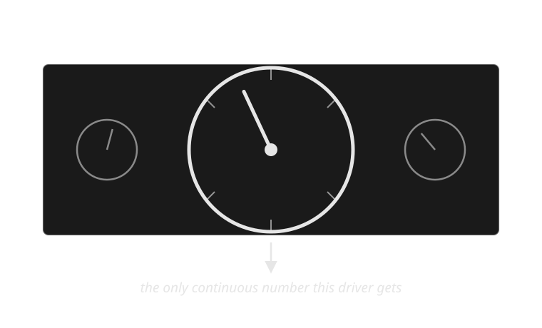
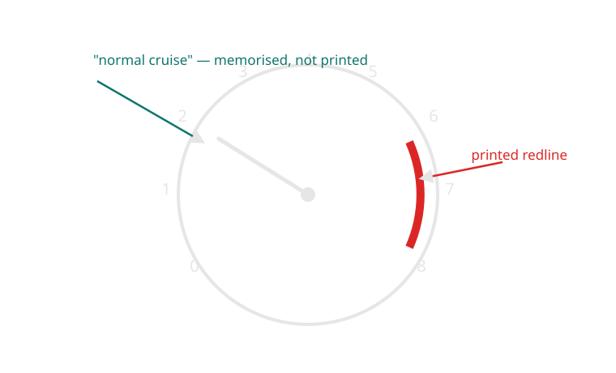
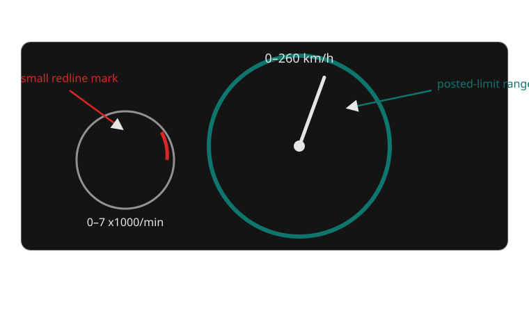

{/* _class: impact */}

# Week 2: Needles and Gauges — The Analogue Century

## Why did continuous analogue gauges dominate for a century, and what did they assume about the person reading them?

For most of the twentieth century, a car had almost nothing to say to its
driver except through a needle, a printed arc, and the driver's own memory of
where that needle "usually" sits.

```notes
Open by asking the room: has anyone driven a car built before 1990? What did
its dashboard actually tell them, compared to the car they usually drive?
```

---

## Learning objectives

By the end of this week you should be able to:

- **Identify** the difference between continuous and discrete instrument
  information, with one real example of each.
- **Explain why** an analogue gauge assumes a trained reader, not just a
  literate one — and what "trained" means here.
- **Compare** Porsche's centred-tachometer layout against a mainstream
  centred-speedometer layout, and state what each design claims matters most
  to its driver.
- **Describe** the step-by-step process a driver runs through to read a gauge
  and decide whether to act on it.
- **Predict** what a car loses, informationally, when a continuous gauge is
  replaced by a single on/off light — this week's bridge into week 3.

---

## Opening example: a speedometer that says nothing in words

Picture the simplest possible instrument: a single needle, a printed arc from
0 to 240 km/h, no digits highlighted, no colour zones. This was the entire
vocabulary of most cars built between 1920 and 1990.

The driver reads it not as a number but as an angle. At a glance, "needle
pointing slightly left of twelve o'clock" means something different from
"needle near the top of the arc" — but only if the driver has already
learned, through hundreds of previous glances, roughly where the needle sits
at motorway speed versus suburban speed.

This is the opening puzzle for the week: the gauge communicates constantly,
but it communicates almost nothing to someone who has never driven that car
before.

---

## The same problem, a second instrument

Put a tachometer next to that speedometer and the puzzle sharpens. Its arc
usually runs from 0 to 7,000 or 8,000 rpm, with a red zone printed near the
top. Unlike the speedometer, there is no legal number here, no posted limit —
the driver is being asked to keep the needle inside a zone the *car*
considers safe for its own mechanism.

This is the first hint of the week's real subject: a gauge doesn't just
display a quantity, it makes a claim about what the driver needs to watch,
and how urgently.

---

## A century of the same format

From roughly 1900 (the first speedometers) to the 1990s (when digital
instrument clusters became cheap enough for mainstream cars), the dominant
dashboard format barely changed: circular dials, printed scales, a swept
needle, sometimes a printed zone in a second colour.

Manufacturers changed the styling, the typography, the number of dials — the
Jaguar E-Type (Week 1) put oil pressure, water temperature, fuel and battery
charge in four small dials either side of two large ones for speed and revs —
but the underlying grammar stayed constant: continuous position implies
continuous information.

That stability is worth explaining on its own terms. It wasn't for lack of
alternatives — idiot lights existed from the 1930s onward for exactly the
failures gauges already covered (Week 3) — but manufacturers kept the gauge
as the default for anything the driver might need to *monitor over time*, not
just be alerted to once.

---

## Continuous signal vs discrete event

This is the conceptual distinction the whole week turns on.

- A **discrete** signal has two states: fine / not fine. A warning light is
  discrete — it is either off or on.
- A **continuous** signal has a position along a scale, and that position
  keeps changing whether or not anything is wrong.

An oil-pressure *gauge* lets a driver notice pressure easing down over
several minutes, long before it would trip a warning light — because the
gauge reports the ongoing state, not a threshold crossing. That difference is
diagnostic: a slow drift is a different problem from a sudden drop, and only
a continuous readout tells them apart.

The trade-off: continuous information takes longer to interpret and depends
on the driver already knowing what "normal" looks like. Week 3 is about what
happens once manufacturers decided that trade-off wasn't worth it for most
drivers, most of the time.

---

## The assumption baked into every needle

A gauge only communicates if its reader already carries a mental reference:
"at this speed, on this road, the needle usually sits about here."

That reference isn't printed on the dial. It's built by repetition — a few
weeks of driving the same car — and it doesn't transfer well. Rent a car with
an unfamiliar tachometer and the red zone is legible instantly (it's printed
in red), but the *normal* cruising position isn't; you learn it by watching
the needle for the first hour, not by reading a label.

This is the sense in which analogue gauges assume a specific kind of driver:
someone who drives this car, or cars very like it, often enough to have
memorised its baseline. Fleet vehicles, rental cars, and first-time drivers
of a model are exactly the situations where that assumption breaks down.

---

## What the earliest dashboards actually gave the driver



*Before the dashboard had a vocabulary, it had one word.*

Even once amperage, oil-pressure and water-temperature gauges became common
through the 1940s–50s, the format was the same for each: a dial, a needle, a
printed scale. The vocabulary grew one word at a time; the grammar — sweep
needle, printed arc — never changed.

---

## The grammar of the dial itself

Once a gauge has more than a bare number, three further conventions appear
almost everywhere by mid-century:

1. **A printed scale** — usually non-linear near the ends, compressed where
   precision matters less.
2. **A colour zone** — green or unmarked for normal operation, red for a zone
   the car should never sit in (redline, overheat).
3. **A needle rest position** — many gauges are designed so "all fine" sits
   near the same clock position (often just past twelve), so a practised
   driver can sanity-check several gauges in one glance without reading any
   of them individually.

That third convention is the one closest to this week's case study:
manufacturers didn't just decide *what* to show, they decided *where on the
dashboard* to put it, and that placement is itself part of the message.

---

## How a driver actually reads a gauge under time pressure

The reading is a chain, not a single perception, and every step can fail:

| Step | What happens | Where it can go wrong |
|---|---|---|
| 1. Locate | Eye finds the gauge's position on the dash | Unfamiliar layout, gauge not centred in view |
| 2. Perceive | Needle angle registers | Poor lighting, needle obscured by wheel |
| 3. Recall | Angle is compared to a remembered "normal" zone | No memorised baseline (rental car, new driver) |
| 4. Judge | Deviation from normal is assessed | Ambiguous zone boundary, gradual drift under-noticed |
| 5. Decide | Driver decides whether to act now, soon, or not at all | Time pressure collapses steps 3–4 into a guess |

Steps 3 and 4 are where analogue gauges are most fragile: they depend on a
memory the driver had to build beforehand, under no time pressure at all, so
that it's available in the half-second glance when pressure is high.

---

## Real example: Volvo's legibility-first cluster (240 series, 1970s–90s)

Volvo's 240-series dashboard applies the same needle-and-arc grammar with an
explicit design priority: legibility over density. Large numerals,
high-contrast markings, a limited instrument count (speed, fuel,
temperature, sometimes a clock) — nothing decorative competing for attention.

It's useful for this week specifically because it shows that "analogue"
doesn't mean "one design" — the format is a shared grammar, but a
manufacturer still chooses which words to include and how loudly to print
them. Volvo's choice reflects a brand priority (safety, clarity) as much as
Porsche's choice reflects a different one (engine awareness).

---

## Real example: Mazda MX-5 (NA, 1989–97)

The original Miata's cluster puts a full-size tachometer and speedometer side
by side, near-identical in size — deliberately refusing to let either
dominate. Mazda's own design brief for the car emphasised driver feedback and
*jinba ittai* (horse and rider as one); an equal-sized tachometer next to the
speedometer is a small, legible instance of that philosophy: this is a car
that wants the driver watching engine behaviour and road speed with equal
attention, not one subordinated to the other.

It's a useful middle case between this week's two poles — it doesn't go as
far as Porsche's tach-dominant layout, but it clearly refuses the mainstream
default of speedometer-first.

---

## A second comparison, before the case study: sweep needle vs digital bar-graph

Many 2020s instrument clusters, including digital displays in mainstream
Honda and Toyota models, render a tachometer as a horizontal or arced bar of
illuminated segments rather than a swept needle.

| Aspect | Sweep needle | Digital bar-graph |
|---|---|---|
| Precision at a glance | Low — angle read approximately | Higher — segment count is more discrete |
| Rate-of-change visibility | High — motion is continuous, easy to track peripherally | Lower — segments step rather than sweep |
| Failure mode | Depends on memorised "normal" position | Often paired with a numeral, reducing that dependency |
| Manufacturing flexibility | Fixed once printed | Reconfigurable in software |

The rate-of-change row matters most for this week's argument: a swept needle
is unusually good, in peripheral vision, at signalling that something is
*changing*, independent of whether the driver consciously reads the exact
value. That property is largely what a discrete light (Week 3) and a stepped
digital bar both give up.

---

## Looking closely at a gauge's rest position



*The dial prints the danger zone. It never prints the safe one.*

That gap — a printed danger zone but no printed "normal" zone — is exactly
the gap a trained reader fills from memory, and exactly the gap this week's
case study is about to make into its central design decision.

---

## Case study: Porsche puts the tachometer in the middle

Porsche's driver's cluster — established with the 356 in the 1950s and
carried through every 911 generation since, including current cars — puts the
**tachometer**, not the speedometer, in the largest, most central position
directly ahead of the driver. The speedometer sits to one side, smaller or
equally sized but never centred.

This is not an accident of history repeated by inertia; Porsche has kept the
layout through digital-instrument transitions where it would have been
trivial to swap the priority. The company's own literature has described the
tachometer as the instrument "you actually drive by" in a car whose engine
note and rev range are central to how it's meant to be operated.

---

## What centring the tachometer assumes about the driver

Centring the tach makes a specific claim: in this car, engine load is the
number you need fastest, faster than road speed, because a driver working the
gearbox and the throttle near the engine's performance band needs a
continuous readout of *where in that band* they currently are, in the same
reflexive glance they'd otherwise spend on speed.

Consequences:

- **Strength:** the driver's fastest, least-effortful glance lands on the
  number that matters most for how the car is being driven, not just how
  fast it's travelling.
- **Weakness:** road speed becomes a secondary glance — in a car capable of
  covering a speed limit almost silently, that's a genuine risk the layout
  accepts in exchange for its priority.
- **Consequence:** the layout only makes sense for a driver expected to
  actively manage engine speed (through gear choice) as part of normal
  driving, not just point the car and press a pedal.

---

## The mainstream default, and a synthesis

Most family cars — a Toyota Camry, a Honda Accord, a Volkswagen Golf in its
everyday trims — centre the **speedometer** instead, with the tachometer
smaller, to one side, or reduced to a digital readout. That layout makes the
opposite claim: the number the driver needs fastest is the one with legal and
safety consequences attached to it directly — the posted limit — and engine
behaviour is background information an automatic transmission mostly manages
for them.

Neither layout is simply correct; each optimises for a different
relationship between driver and machine. A synthesis worth proposing to
students: a layout that lets *drive mode* (sport vs comfort/eco) re-centre
the priority instrument electronically — something only a reconfigurable
digital cluster (foreshadowing weeks 8–12) can actually do, since a printed
analogue dial can't swap which gauge is biggest depending on context.

---

## Side by side: two layouts, two claims

| Aspect | Porsche (tach-centred) | Mainstream (speedo-centred) |
|---|---|---|
| Centred instrument | Tachometer | Speedometer |
| Implicit claim | Engine load is the fastest-needed number | Road speed is the fastest-needed number |
| Assumes a driver who... | Actively manages engine speed via gear choice | Is regulated primarily by posted limits |
| Speedometer's role | Secondary, still present, smaller/offset | Primary, largest dial |
| Where it appears | Porsche 356 through current 911/Cayman/Boxster | Camry, Accord, Golf, most mainstream sedans/hatches |

---

## Reading a mainstream cluster the same way



*Same grammar, opposite priority — the biggest dial is the one with a legal number attached.*

Place this image next to the Porsche cluster from an earlier slide and the
comparison teaches itself: both use dials, arcs and needles, and still
disagree about what a driver most needs to see first.

```comment
This slide is deliberately paired with the earlier Porsche image slide rather
than merged into one slide — the point is that students hold both in view at
once, which the deck format doesn't do well on a single slide, but a printed
handout or the studio session can.
```

---

## Studio preview: read three clusters, argue about priority

Bring (or find online) driver's-eye photographs of three dashboards from
different classes of car — for example, one performance car, one mainstream
family car, one commercial or fleet vehicle.

For each, work out:

1. Which instrument is centred and largest?
2. What does that placement claim matters most to the driver?
3. Would a first-time driver of this exact car be able to read the "normal"
   zone of that instrument without having driven it before?
4. If you swapped this car's centred instrument for its neighbour's, what
   would break about the driving experience it's designed for?

```notes
Sample direction: students often default to "the tachometer is for sports
cars, the speedometer is for normal cars" — push them past that into *why*,
using question 3 to surface the trained-reader problem from earlier in the
lecture, and question 4 to force them to argue the layout is a deliberate
claim rather than a styling choice.
```

---

## Mini knowledge check

1. What is the difference between a continuous signal and a discrete signal,
   in one sentence each?
2. Why can't a first-time renter of a car reliably read its tachometer's
   "normal" cruising position, even though the redline is clearly printed?
3. Porsche centres the tachometer; a Toyota Camry centres the speedometer.
   State, in one sentence each, what claim each layout makes about its
   driver.
4. Name one thing a swept analogue needle communicates in peripheral vision
   that a single on/off light (next week's topic) cannot.

```notes
Answers: (1) continuous = position varies constantly and carries meaning at
every point; discrete = only two meaningful states, on/off. (2) the redline
is printed but the "normal" zone isn't — that has to be learned by watching
the needle over time in that specific car. (3) Porsche: engine load is the
fastest-needed number; Camry: road speed, tied to the posted limit, is what's
needed fastest. (4) rate of change / trend — a needle sweeping shows
something is changing, not just that a threshold has been crossed.
```

---

## Summary

- Analogue gauges dominated for a century because they show **continuous
  state**, not just threshold crossings — valuable for anything a driver
  needs to monitor over time, not just be alerted to once.
- That format assumes a **trained reader**: someone who already knows, from
  repetition, where the needle sits when everything is fine, since dials
  print danger zones but rarely print the normal one.
- **Where** a gauge sits on the dashboard is itself part of the message —
  Porsche's centred tachometer and a mainstream centred speedometer are the
  same grammar making opposite claims about what the driver needs fastest.
- Reading a gauge under time pressure is a five-step chain (locate, perceive,
  recall, judge, decide), and the middle two steps are exactly where the
  trained-reader assumption can fail.

---

## Bridge to week 3: what happens when the needle becomes a light

Everything this week described — a printed danger zone, a memorised normal
position, a continuous readout a driver could watch drift over minutes —
assumes the driver has time and training to use it.

From the 1950s–60s, US manufacturers began replacing oil-pressure and ammeter
gauges with a single warning light: no zone, no drift, no memorised baseline
required, just off or on. Week 3 asks what that trade gained (a message any
driver, trained or not, can read instantly) and what it threw away (the
slow-drift information a gauge alone could show) — using the same
oil-pressure instrument this week already introduced as the through-line
between the two weeks.

---

{/* _class: impact */}

## From a century of needles to one light

Next week: the idiot light — what a dashboard gains, and loses, when a
continuous gauge becomes a single on/off signal.

```notes
Close by returning to the room's opening answers about pre-1990 cars: ask
whether anyone's example car already had an idiot light alongside its
gauges, since most did by the 1960s — that's the seam week 3 picks up.
```
