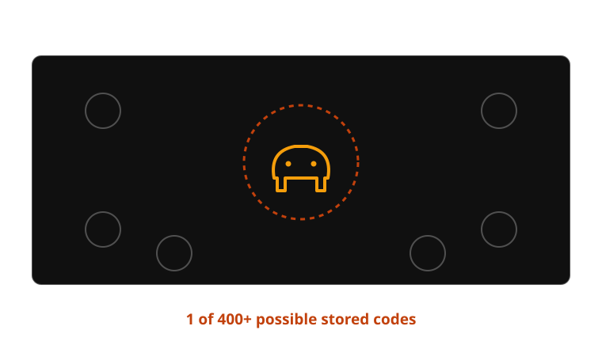
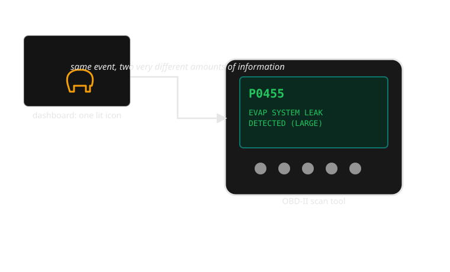

{/* _class: impact */}

# Week 3: The idiot light

## What is lost, and what is gained, when a continuous measurement becomes a single light?

From the 1950s–60s US gauge-to-light shift to the modern check-engine light

```notes
Open by asking the room: how many of you have ever looked at your own
check-engine light and known, from the light alone, what was wrong? Nobody's
hand goes up. That's the whole lecture.
```

---

## Learning objectives

By the end of this week you should be able to:

- **identify** whether a given telltale is switched from a continuous signal
  or a genuinely binary one
- **explain why** US manufacturers replaced oil-pressure and ammeter gauges
  with warning lights in the 1950s–60s, in the terms manufacturers themselves
  used
- **compare** a continuous gauge and a single warning light across
  precision, glanceability, cost, and behaviour right before failure
- **describe** why the check-engine light is the idiot light's logic taken
  to its most ambiguous extreme
- **propose** at least one concrete way to recover some of the lost
  information without returning to a full gauge

```notes
Read these once, then move fast — the objectives land better as a
checklist to return to at the end (they map directly onto the summary
slide) than as something to dwell on now.
```

---

## Opening example: the light comes on

You're driving. An amber engine-shaped icon lights up on the cluster. No
number, no word, no colour change if it gets worse. It stays on, steady,
until you turn the engine off and on again or a mechanic clears it.

That single icon is standing in for one of several hundred possible stored
diagnostic trouble codes — a loose fuel cap, a failing oxygen sensor, a
misfiring cylinder that could be quietly destroying your catalytic converter
right now. The car knows which one. The dashboard doesn't tell you.

```notes
If anyone volunteers a real story of ignoring their own check-engine light
for months, use it — it's the perfect illustration of where this lecture
ends up (alarm fatigue, week 10's topic) landing early.
```

---

## Opening example: what the driver actually knows

Everything the check-engine light gives the driver is contained in the fact
that it is *on*. It does not say:

- how urgent — pull over now, or fine until the weekend
- how expensive — a $2 fuel cap or a $2,000 catalytic converter
- whether it's getting worse — the light doesn't brighten, blink faster, or
  change colour as a small problem becomes a large one (with one narrow
  exception we'll get to)

This is the end state of a design lineage that starts with the oil-pressure
gauge disappearing from a 1958 Chevrolet. Today's lecture traces that
lineage.

```notes
Name the shape explicitly here: everything from this point on is one
process — continuous signal, threshold, binary decision, one lamp — showing
up again and again with different inputs. Students who spot that pattern
early get more out of the case studies that follow.
```

---

## What a gauge encodes that a light throws away

A continuous gauge carries at least three kinds of information a binary
light cannot:

1. **Magnitude** — not just "low," but *how* low: 15 psi is not 2 psi.
2. **Rate of change** — a needle drifting down over ten minutes looks
   different from one that drops in a second; a light only ever switches.
3. **Trend across time** — a driver who checks the gauge daily builds a
   mental baseline ("it usually sits just above centre") and notices
   deviation from *their* car's normal, not a generic threshold.

A light collapses all three into one fact: are we above the line, or below
it. That is not a smaller version of the same information — it is a
different kind of information.

```notes
Push on "different kind," not "smaller amount" — students will want to say
the light is just a lossy-compressed gauge, and the rest of the lecture is
the argument against that framing.
```

---

## Why manufacturers made the swap

Through the 1950s, US manufacturers' own research kept turning up the same
result: a large share of drivers either never looked at the oil-pressure or
ammeter gauge, or looked at it without knowing what a normal reading was for
their car. An instrument that isn't read correctly isn't delivering
continuous information at all — it's delivering nothing, while still costing
dashboard space, wiring, and a sending unit to manufacture.

Read that way, the decision wasn't a downgrade. It was a correction: stop
paying for precision nobody was using, and spend the saving on a signal
nobody can misread. The idiot light is a rational response to a real
measured failure of the gauge, not just cheapness.

```notes
This is the evidence the later misconception slide names directly — plant
it firmly here so that slide reads as a callback, not a new claim. Ask the
room: "so was this cost-cutting?" before answering — most will say yes,
which is exactly the gap the misconception slide closes.
```

---

## The mechanism: how an idiot light actually works

An oil-pressure telltale is wired to a **pressure switch**, not a
pressure sensor. The switch has exactly one job: close a circuit (lighting
the lamp) when pressure falls below a fixed threshold, and open it
(extinguishing the lamp) above that threshold. There is no wiring path for
"pressure is fine but declining" — the switch physically cannot represent
it. The ammeter's replacement, an idiot light on the charging system, works
the same way off a voltage comparator.

This is the process worth holding onto for the rest of the week: **a
continuous physical quantity, reduced to one threshold, reduced to one
circuit state, reduced to one lamp.** Every later telltale — tyre pressure,
brake fluid, check engine — inherits this same shape.

```notes
Physically hold up (or sketch) a simple switch if you have one — the point
that lands hardest is that there is no wire for "getting close." The
absence isn't a software limitation, it's a hardware one.
```

---

## Process: from sensor reading to lit lamp

| Stage | What exists | What survives to the next stage |
| --- | --- | --- |
| 1. Continuous signal | Oil pressure, 0–80 psi, changing constantly | Everything |
| 2. Threshold check | Compare reading to a fixed cutoff (e.g. 7 psi) | One bit: above / below |
| 3. Binary decision | "Fine" or "not fine" — nothing in between | The bit only |
| 4. Single light | Lamp off, or lamp on | Nothing more than "attend now" |

Every value from 8 psi to 80 psi is stage-1 information that stage-4 renders
identically to every other value in that range: **fine**. The driver at 9
psi and the driver at 79 psi see the same dashboard.

```comment
This table is the slide to slow down on — it's the whole week's argument
compressed into four rows, and every later example (TPMS, check engine, the
Alert Audit brief in week 4) is a variation on the same four stages.
```

```notes
Read the last line aloud slowly: 9 psi and 79 psi, same dashboard. That's
the whole week in one sentence. The diagram on the next slide is the same
four rows, redrawn as boxes — use it if the table alone doesn't land.
```

---

## The same process, as a diagram

<div class="dash-flow">
  <div class="dash-flow__step">
    <span class="dash-flow__step-label">Stage 1</span>
    Continuous signal — oil pressure, 0–80 psi, changing constantly
  </div>
  <div class="dash-flow__step">
    <span class="dash-flow__step-label">Stage 2</span>
    Threshold check — compare the reading to a fixed cutoff (e.g. 7 psi)
  </div>
  <div class="dash-flow__step">
    <span class="dash-flow__step-label">Stage 3</span>
    Binary decision — "fine" or "not fine," nothing in between
  </div>
  <div class="dash-flow__step">
    <span class="dash-flow__step-label">Stage 4</span>
    Single light — lamp off, or lamp on
  </div>
</div>

Each arrow is a place information is thrown away, not just relayed forward.

```notes
Point at each arrow in turn and ask "what does this arrow delete?" Stage
1→2 deletes magnitude away from the threshold. Stage 2→3 deletes how close
to the threshold. Stage 3→4 deletes nothing further — by this point there's
only one bit left to lose.
```

---

## Real example: the 1958–1965 US full-size sedan

By the late 1950s, full-size Chevrolets and Fords were shipping with a
telltale-only instrument panel as standard equipment — an oil-pressure
light and a charge light where a gauge used to sit — with the full gauge
package sold back as an extra-cost option on some trims. This is a rare
case where the *cheaper* version and the *simplified* version were the same
car: buyers who wanted the old continuous readout had to pay to get it back.
That inversion — simplicity as the default, precision as the upsell — is the
detail worth remembering when the case study returns later in the lecture.

```notes
Worth a beat of silence: ask who assumed "simpler" always means "cheaper
version, sold to people who couldn't afford better." This case study is
evidence against that assumption on its own terms — the gauge was the
option, not the standard.
```

---


*Same model, same year, two different answers to the same question.*

```notes
Give this one a few extra seconds on screen — it's the slide students
photograph. If you're short on time elsewhere, this is not the slide to
rush past.
```

---

## Real example: BMW Check Control

BMW's Check Control system, introduced in the early 1980s, is an attempt to
put some of the lost information back — not by returning to a gauge, but by
adding a short text sentence alongside the light: "CHECK BRAKE LIGHT" rather
than a single generic lamp. It's useful for this week because it shows that
the *binary switch* (something's wrong / it isn't) and the *vocabulary*
naming what's wrong are separable design decisions — you can keep the
one-bit trigger and still fix the ambiguity by spending words on it. That's
next week's topic; here it's evidence that manufacturers noticed the same
gap you're noticing now, decades before the check-engine light existed.

```notes
Don't let this slide become a Check Control history lesson — the one point
that matters is "binary trigger" and "vocabulary" are separable decisions.
Everything else is colour.
```

---

## Real example: Honda's blinking check-engine light

Honda's dashboards (like most OBD-II-compliant cars) use one lamp in two
*patterns*: steady illumination for most stored fault codes, but a
**flashing** malfunction indicator specifically for an active misfire severe
enough to damage the catalytic converter within a short drive. This is the
idiot light's one-bit logic smuggling in a second bit through timing rather
than a second lamp — useful here because it's the cheapest possible fix
(no new hardware, no new colour) and it still only distinguishes "urgent"
from "not urgent," not which of several hundred codes triggered either
state.

```notes
The one-liner to land: a second bit doesn't have to mean a second lamp.
Timing (steady vs flashing) is free — no new hardware, no new colour — which
is exactly why it's the cheapest fix a manufacturer can ship.
```

---

## Real example: Volvo's TPMS convention

Many Volvo models (and most tyre-pressure-monitoring systems built to the
same convention) use a **steady** low-pressure telltale to mean "a tyre is
underinflated" and a **flashing** version of the same lamp to mean "the
monitoring system itself has a fault and can't tell you." It's useful here
as a direct contrast with Honda's blink convention: same technique (steady
vs flashing), applied to distinguish a *measured problem* from an *unmeasured
unknown* rather than to rank urgency. Two manufacturers, the same one extra
bit, spent on two different distinctions.

```notes
Ask the room which distinction (Honda's urgency tier, or Volvo's
fault-vs-unknown) they'd rather have if they could only pick one — there's
no obviously correct answer, which is the point: the same one extra bit can
be spent on genuinely different things.
```

---

## Comparing two interface approaches directly

**Full gauge package (optional, late-1950s trim)** vs **standard telltale
package (same car, base trim):** the gauge lets an attentive owner catch a
slow oil-pressure decline over weeks, at the cost of a component owners
statistically weren't reading correctly. The telltale guarantees every owner
notices *a* problem, at the cost of guaranteeing none of them see it coming.
Neither approach is a strict improvement on the other — they're optimising
for different failure modes: the rare owner who reads gauges well, versus
the common owner who doesn't.

```notes
This is the slide to make the trade-off explicit and neutral — resist the
pull to declare a winner. Both are optimal for a different population of
drivers, and the next image slide is the visual version of the telltale
side of this comparison.
```

---



*The dashboard's entire message is: something is wrong. Somewhere.*

```notes
Let this sit on screen a moment before talking — the callout number (400+)
usually gets an audible reaction, which is a better setup for the next
slide than anything you'd say over it.
```

---

## Case study: the check-engine light's ambiguity

The check-engine light (the malfunction indicator lamp, standardised under
OBD-II in US vehicles from 1996) inherits the idiot light's exact shape —
sensor, threshold, binary decision, one lamp — but the mapping from "on" to
"cause" exploded. Where an oil-pressure light has one plausible cause behind
it, a modern MIL can be triggered by any of several hundred distinct
diagnostic trouble codes stored in the engine control unit, covering
everything from a loose fuel cap to a failing catalytic converter. The
lamp's design intent — guarantee every driver notices *something* — succeeds
completely. Its cost is that the driver learns nothing about *what*, and the
dashboard has no vocabulary for telling them apart.

```notes
Name the shape again explicitly: same sensor-threshold-decision-lamp
process as the pressure switch, just with the "sensor" replaced by an ECU
capable of detecting hundreds of distinct faults. The hardware got smarter;
the presentation didn't.
```

---

## Case study: consequences for the driver

Because the light can't distinguish severity, drivers rationally learn to
distrust it in exactly the way alarm designers dread: some check-engine
triggers really are a loose fuel cap that clears itself in a day or two, and
some are a misfire actively damaging a catalytic converter with every
kilometre driven. A driver who has been safely ignored the light twice
before has no dashboard-level reason to treat the third instance
differently — the interface gives identical signals to a $40 problem and a
$2,000 one. This is an early, mild version of the alarm-fatigue problem week
10 covers in full: ambiguity, sustained long enough, teaches drivers to
downweight the alarm itself.

```notes
This is the deliberate early plant for week 10 — say so explicitly, don't
just gesture at it. Alarm fatigue is easier to teach later if students
already have this concrete, low-stakes version of it in mind.
```

---

## Case study: a synthesis worth wanting

The fix doesn't require abandoning the one-bit lamp — it requires spending a
*second* signal alongside it, the way BMW's Check Control and Honda's blink
convention each already do in miniature. A synthesis: keep the guaranteed,
unmissable lamp for "attend to this," but pair it with a severity tier (a
distinct colour or blink pattern for "drive-damaging now" versus
"schedule a service") and route the actual diagnostic code to wherever the
driver already looks for detail — a companion app, a multi-info display, a
dealer scan tool. That's not a hardware problem any more. It's a vocabulary
problem, which is where next week starts.

```notes
This is the slide where the "synthesis" stops being aspirational — every
piece of it (severity tier, routed detail) is something a real
manufacturer has already shipped somewhere in this lecture. Say that
explicitly: this isn't a hypothetical fix, it's an assembly of existing
parts.
```

---



*Everything the dashboard didn't tell you was sitting in the car the whole time.*

```notes
Let the gap between the scan tool's specificity and the dashboard's single
icon speak for itself for a second before moving on — it's the clearest
visual argument in the whole deck for "the information exists, the
dashboard just doesn't show it."
```

---

## The full signal chain, and where it collapses

<div class="dash-flow">
  <div class="dash-flow__step">
    <span class="dash-flow__step-label">Sensor reading</span>
    Oil pressure, temperature, or an ECU fault code — continuous or
    discrete, but rich <span class="dash-badge dash-badge--normal">survives</span>
  </div>
  <div class="dash-flow__step">
    <span class="dash-flow__step-label">Interpretation & severity</span>
    Software or a switch decides what the reading means and how urgent it is
    <span class="dash-badge dash-badge--caution">thin</span>
  </div>
  <div class="dash-flow__step">
    <span class="dash-flow__step-label">Presentation</span>
    One lamp, one colour, one icon — whatever the dashboard has to show it
    with <span class="dash-badge dash-badge--critical">collapses</span>
  </div>
  <div class="dash-flow__step">
    <span class="dash-flow__step-label">Driver interpretation</span>
    The driver reconstructs meaning from a single bit and whatever they
    remember <span class="dash-badge dash-badge--critical">collapses</span>
  </div>
  <div class="dash-flow__step">
    <span class="dash-flow__step-label">Response</span>
    Pull over, ignore, or guess — the driver's action, built on what's left
    <span class="dash-badge dash-badge--caution">thin</span>
  </div>
</div>

This is the same shape as the four-stage table earlier, drawn wide enough to
show where a fix (Check Control's text, Honda's blink) actually lands: at
presentation, the one stage a manufacturer can improve without new sensors.

```notes
This is the master chain the whole course keeps returning to — sensor,
interpretation, presentation, driver interpretation, response. Every fix
proposed this lecture (Check Control, Honda's blink, Volvo's flash) is a
patch applied at exactly one link: presentation. None of them touch
interpretation or response, which is worth naming explicitly.
```

---

## Comparison: continuous gauge vs single warning light

| Dimension | Continuous gauge | Single warning light |
| --- | --- | --- |
| Precision | Exact value, any point in range | One bit: above or below threshold |
| Glanceability | Requires reading a position against a learned baseline | Instant — lit or unlit, no interpretation |
| Manufacturing cost | Sensor, mechanical or electronic gauge, wiring | Simple switch/comparator, one lamp |
| Right before failure | Trend visible in advance, if the driver was watching | Often silent until the threshold is crossed |
| Cost of driver inattention | High — an unread gauge gives no warning at all | Low — impossible to misread when lit |

```notes
Treat this table as a recap, not new content — every cell should already
feel obvious from the case studies. If it doesn't, that's a sign to go back
rather than push forward into the exercise.
```

---

## Exercise: build the missing middle state

Take the check-engine light as it exists today. In groups, design **one**
additional state — a colour, a blink pattern, or a short accompanying text
string — that would let the dashboard distinguish "this can wait" from "pull
over soon," without adding a screen or a full gauge back.

Questions to work through:

- What underlying signal would you need the ECU to expose to drive that
  extra state?
- Does your solution risk teaching drivers to ignore the *new* calm state
  the same way they learned to distrust the old single one?
- Would your fix have been physically buildable with 1958 pressure-switch
  technology, or does it require something a mechanical telltale couldn't
  do?

```notes
Give groups 4-5 minutes on the three questions before moving to the debrief
slide — the second question is the one worth pushing on if a group finishes
early, it's where the real tension lives.
```

---

## Exercise debrief: a model answer

Most groups land on one of two directions:

- **Colour-tiering** — amber for "schedule a service" codes, red for
  "misfire/emissions-damage" codes, using the ECU's own severity
  classification to pick which colour to light
- **A blink convention** — steady for most codes, flashing for the same
  narrow "active misfire" case Honda already flags, reusing a distinction
  Honda's system already computes

Both are only buildable because the ECU already computes something a 1958
pressure switch never could: a severity classification, not just a
threshold crossing. That's the real constraint the exercise is testing —
not creativity, but noticing what information the modern system actually
has available to spend.

The harder question survives either answer: a new "calm" state is itself a
threshold, and thresholds are exactly what this week has argued lose
information. There is no fully lossless fix with one lamp — only a choice
about which distinction is worth the second bit.

```notes
If a group proposed moving everything to a screen, use this slide to name
why that was ruled out: this week's constraint is one lamp, and the point
is to feel that limit, not escape it via more hardware.
```

---

## Mini knowledge check

1. Why couldn't a 1960s idiot light represent "oil pressure is fine but
   declining"? Name the specific component responsible.
2. Name one real manufacturer convention (from today's lecture) that adds a
   second bit of information to a single warning lamp, and say what
   distinction it's used for.
3. A check-engine light is triggered by both a loose fuel cap and a
   misfiring cylinder. What, specifically, does the light fail to tell the
   driver that would let them tell these apart?
4. Is the 1950s–60s switch to idiot lights better described as a cost-saving
   measure or a response to a measured design failure? Defend your answer.

```notes
Give this a minute of individual or pair work before revealing the answers
slide — question 4 is the one to watch, since it's a rehearsal for the
misconception slide two slides from now.
```

---

## Mini knowledge check — answers

1. The pressure switch is a simple open/closed comparator against one fixed
   threshold — it has no output for "close to the threshold" or "moving
   toward it," only above/below.
2. BMW Check Control (a text sentence naming the fault), Honda's blinking
   MIL (an urgency tier via blink pattern), or Volvo's TPMS steady/flash
   convention (a measured fault vs a system fault) — any one, correctly
   explained.
3. Severity/urgency and the identity of the fault — the light gives no
   signal that would let a driver rank these two faults against each
   other.
4. Accept either answer if argued from evidence: the lecture's framing is
   that it's both — manufacturers' own research into misread gauges is
   what makes "cost-saving" and "design correction" not mutually exclusive
   here.

```notes
Question 4's answer is deliberately unsettled here — the next slide names
the misconception directly and argues for "both" more fully. Don't
over-resolve it on this slide.
```

---

## Common misconception: "it was just cheapness"

The idiot light is easy to read as a manufacturer cutting a corner — remove
a gauge, save a sensor, sell the same car for less to build. That story is
half true, and it's the half that misses the point.

Manufacturers had internal research showing gauges were being misread or
ignored outright. Removing a component most drivers weren't using correctly
isn't purely a cost decision — it's a response to a measured usability
failure, the kind a modern designer would recognise as evidence-driven, not
corner-cutting. The 1958–1965 case study earlier this lecture makes the same
point from the other direction: some trims sold the *gauge* as the paid
upgrade, which only makes sense if the telltale was the intended default,
not a downgrade forced by economy.

The two explanations aren't in competition. Cost savings and a genuine
usability correction pointed the same direction at the same time, which is
exactly why the light won so completely and so fast.

```notes
This is the slide the "why manufacturers made the swap" slide and the
1958-sedan case study were both planted for — call back to both explicitly.
Watch for students who want a single cause; the point of this slide is that
two true explanations can coexist without either one being "the real one."
```

---

## Reflection

Before this lecture, would you have described a single warning light as a
*simpler* version of a gauge, or a *different kind* of instrument?

Write two or three sentences on what changed your answer — or on why it
didn't. If it didn't change, say what would have needed to be true for you
to see the light as something other than a shrunk-down gauge.

```notes
Give this thirty seconds of actual silence before moving on — it's a
metacognitive check, not a discussion prompt, and it works better written
than spoken. Don't let it collapse into a verbal recap of the summary
slide; that's what the next slide is for.
```

---

## Summary

- A gauge and a light are not the same information at different sizes — a
  light throws away magnitude, rate of change, and trend, keeping only one
  bit
- The idiot-light shift wasn't just cost-cutting: manufacturers had
  evidence that many drivers weren't reading gauges correctly, making the
  "lost" precision partly illusory in practice
- The check-engine light is the idiot light's exact logic, with the mapping
  from "on" to "cause" exploded from one plausible fault to hundreds
- Real manufacturers (BMW, Honda, Volvo) have each, independently, tried to
  smuggle a second bit of information into a single lamp — proof the gap is
  real and known, not a flaw only visible in hindsight
- Recovering lost information doesn't require a gauge back — it requires
  spending a second signal (colour, pattern, or text) alongside the one bit

```notes
Read these against the learning objectives slide from the start — they
should map one-to-one. If a student can't connect a bullet here back to an
objective, that's the one to spend the last two minutes reinforcing.
```

---

## References and further reading

- SAE J1979 and J2012 — On-Board Diagnostics standards defining diagnostic
  trouble codes and the malfunction indicator lamp
- U.S. Environmental Protection Agency OBD-II regulations, mandating
  standardised on-board diagnostics on US light vehicles from 1996
- BMW Check Control owner and service documentation
- Honda malfunction-indicator-lamp blink-code service literature
- SAE and ISO tyre-pressure-monitoring-system documentation covering the
  Volvo-style steady/flash convention

```notes
If a student asks for a specific document, the service-literature citations
are manufacturer-internal and vary by model year — point them at SAE J1979
first, it's the one stable public reference underlying all three case
studies.
```

---

## Bridge to week 4

Every fix this week gestured at — a text sentence, a blink pattern, a colour
tier — depends on the driver being able to tell *which* light they're
looking at in the first place. A single red lamp is unambiguous in isolation;
a dashboard with a dozen amber lamps in a row is not, unless each one carries
a symbol specific enough to name its own fault at a glance, in any language,
without reading a word. That's the vocabulary problem next week studies
directly: ISO 2575 and the slow, real convergence on a shared set of
dashboard icons — starting with the tyre-pressure pictogram, which took the
industry years to agree on.

```notes
Don't just read the bridge paragraph — physically point back at the
mil-icon-cluster slide's amber icon as the concrete thing that has no
vocabulary yet. It's the same icon this whole lecture used as its running
example, which is why it works as a bridge rather than a new topic.
```

---

{/* _class: impact */}

## Next: icons and symbols

A light needs a symbol before it can say more than "attend to this."

Week 4 — building a shared vocabulary. Assessment 1, the Alert Audit, is due
at the end of that week.

```notes
Close on the same question the lecture opened with — nobody could read
their own check-engine light from the icon alone. Week 4 is where that gets
fixed.
```
