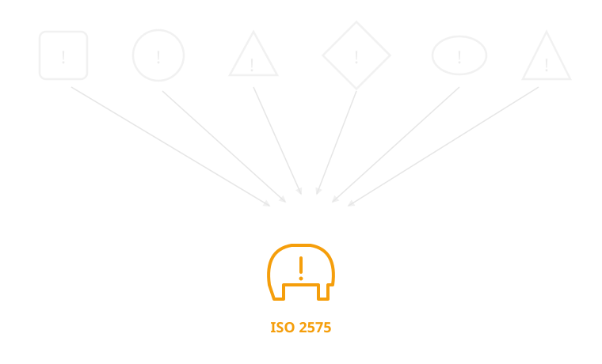
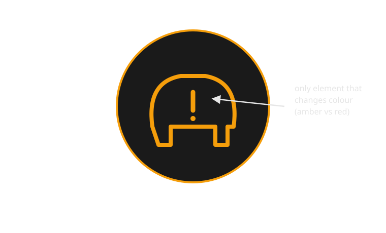
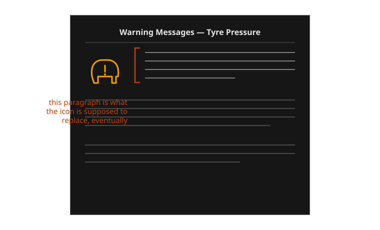

{/* _class: impact */}

# Week 4

## Icons and symbols: building a shared vocabulary

How does a tiny icon come to mean the same thing across languages, literacy
levels, and decades?

```notes
Open by asking who in the room can draw the low-tyre-pressure symbol from
memory right now. Most people can. That's the whole week in one demo — ask
them why they're all drawing the same thing.
```

---

## Learning objectives

By the end of this week you should be able to:

- **identify** a dashboard icon that would fail to communicate to someone
  seeing it for the first time, with no caption
- **explain why** a shared icon vocabulary requires regulation or a
  standards body, not just good design taste, to actually converge
- **compare** two manufacturers' pre-standardisation symbols for the same
  warning and state which design assumption each one made about the driver
- **trace** the TPMS icon's path from manufacturer-specific symbol to
  ISO 2575 pictogram, naming the regulatory trigger at each stage
- **distinguish**, on a real dashboard, an icon that is legible on its own
  from one that is legible only because the driver already knows the car

---

## Opening example: a light you've never seen before

A driver starts a car they don't own — a rental, a partner's car, a loaner
while their own is serviced. A small amber icon lights up on the cluster:
a rounded shape with a horseshoe outline and an exclamation mark inside it.

They have never seen this exact icon before. Is it urgent? Is it about the
engine, the brakes, the tyres, something electronic they've never had to
think about? The manual is in the glovebox, in a language they may or may
not read fluently, indexed by a numbering system they don't know.

```notes
The icon in question is a plausible low-tyre-pressure symbol variant. Don't
name the answer yet — let the ambiguity sit for a beat before slide 4.
```

---

## Opening example: what the car is trying to say

The car is not being obscure on purpose. It is trying to compress a
specific, checkable fact — "one of your tyres is below its target
pressure" — into a shape small enough to fit in a cluster the size of a
coin, readable in under a second, in a car the manufacturer expects to be
driven by people who never read the manual cover to cover.

That compression only works if the driver already has the shape memorised
from a different car. This is the whole problem of the week: an icon is
useless the first time and nearly automatic the fiftieth time, and the gap
between those two states is where a shared vocabulary either does or
doesn't exist.

---

## What makes an icon "shared" rather than just "used"

A manufacturer can use an icon on every car it sells for twenty years and
it still isn't shared — it's just familiar to that manufacturer's
customers. A shared icon has to survive being carried out of its home
brand: an ISO-standard tyre-pressure icon means the same thing whether the
driver last saw it on a Toyota, rented a Volkswagen, and is now looking at
it in a Volvo. That portability is the entire point, and it is not a
property individual manufacturers can create by themselves, however well
they design.

---

## Three grammars, one zoom-in

Weeks 2 and 3 established two grammars: the continuous needle (read a
trend) and the binary idiot light (read a threshold crossing). This week
zooms into what fills that light once it stops being a bare bulb — the
icon inside it. An icon adds a third axis idiot lights don't have: which
of several possible faults is this, without needing a different physical
lamp for each one. A single amber telltale housing can mean twenty
different things across twenty different cars purely by swapping the
pictogram behind the glass.

---

## Comparison: two pre-standard tyre-warning icons

Before TPMS was mandated, two manufacturers solving the same problem — warn
the driver about a soft tyre — made visibly different bets about what the
driver already knew.

| Aspect | Manufacturer A (generic alert reuse) | Manufacturer B (literal wheel icon) |
|---|---|---|
| Symbol | Plain "!" inside a circle | Side-profile wheel and tyre outline |
| Design assumption | Driver will check the manual to disambiguate which system this generic symbol refers to | Driver will recognise a wheel shape without training |
| Strength | Cheap to produce, reused existing tooling | Narrows the guess to "something about the wheels" |
| Weakness | Indistinguishable from a dozen other generic faults on the same dashboard | Still doesn't say pressure specifically — could look like a flat, a brake fault, a sensor fault |

```notes
This is a constructed but representative pair — the point is the design
logic, not attributing it to a specific named model in this slide (the
named-manufacturer examples come a few slides later).
```

---



*Before ISO 2575, "check your tyre pressure" had no fixed shape — after it, it had exactly one.*

---

## Real example: Toyota and staggered market rollout

Toyota is useful here because it sold TPMS-equipped and non-TPMS-equipped
versions of very similar models simultaneously across different markets
through the 2000s, as the US mandate phased in ahead of other regions. The
same nameplate could carry the ISO tyre-pressure icon in one market and
nothing equivalent in another, for the same generation of car. That split
makes the regulatory trigger visible in a way a single-market manufacturer
can't show you — the icon didn't spread because Toyota decided tyre
pressure mattered more in the US, it spread because the US legally required
it there first.

---

## Real example: Volvo and the safety-first exception

Volvo is useful for the opposite reason. Volvo's stated brand identity is
safety leadership, and TPMS appeared on Volvo models before it was legally
required in several of Volvo's markets. This is the case that tests the
week's claim: didn't a safety-focused manufacturer converge on this icon
voluntarily, without regulation? Mostly no — Volvo adopted the *function*
early, but still used the ISO 2575 *icon*, not a proprietary Volvo symbol,
once the standard existed. Volvo led on fitting the sensor; it followed the
standards body on drawing the icon.

---

## Real example: Honda and icon simplification across trims

Honda sells the same core model across many trim levels with different
cluster hardware — a basic analogue cluster in an entry trim, a
configurable digital display in a higher one. The tyre-pressure icon is one
of the few elements that stays pixel-for-pixel identical across that whole
spread, even as everything around it changes resolution and layout. That
consistency is deliberate: a standardised icon is exactly the element a
manufacturer can't afford to reinterpret trim-to-trim, because its entire
value is that it looks the same everywhere.

---



*The pictogram that won: a tyre cross-section and an exclamation mark, unchanged across manufacturers since the mid-2000s.*

---

## How an icon vocabulary becomes shared: the process

This doesn't happen by manufacturers quietly agreeing it would be nice.
It follows a fairly consistent sequence:

1. **A manufacturer designs a symbol** for a function only it currently
   offers, with no expectation anyone else will use it
2. **A regulator mandates the function** itself (not the symbol) — TPMS
   after the TREAD Act required the underlying sensor, not any particular
   icon
3. **Competing symbols are submitted or surveyed** across manufacturers now
   forced to add the same feature at the same time
4. **A standards body (ISO/SAE) selects or drafts one symbol** — ISO 2575
   for tyre pressure, drawing on but not identical to any single
   manufacturer's original design
5. **The standard propagates** as manufacturers redesign clusters to comply
   and avoid the cost of maintaining a non-standard alternative
6. **Drivers learn it through repeated exposure across different cars**,
   which is the only step that actually makes the icon "shared" rather than
   merely "specified"

---

## Case study: before regulation, chaos

Before TPMS existed as a legal requirement, a manufacturer that wanted to
warn about tyre pressure at all had to invent the warning from scratch,
with no shared reference to design against. The result across the industry
was genuinely inconsistent: generic exclamation marks reused from other
warning categories, literal wheel-and-tyre side profiles, occasionally no
icon at all — just a line of text buried in a multi-function display menu
a driver had to actively page through to find. None of these were wrong,
exactly. Each was a reasonable local answer to a problem nobody had agreed
on a shared solution for yet.

---

## Case study: the TREAD Act forces the issue

The trigger was not a design competition — it was a product-liability
crisis. Tread separation on under-inflated Firestone tyres fitted to Ford
Explorers through the 1990s was linked to a wave of rollover deaths. The
US TREAD Act (2000) responded by mandating tyre-pressure monitoring systems
on new vehicles, phased in through the mid-2000s. This is the pivotal fact
of the case study: the law mandated the *sensor and the warning function*,
not any specific pictogram. The icon convergence that followed was an
industry response to that mandate, not a term written into the law itself.

---

## Case study: convergence and its consequences

With every manufacturer suddenly required to add the same function on the
same rough timeline, drawing a brand-new proprietary icon carried a real
cost with no offsetting benefit — a driver has to relearn it, a
translator has to localise any accompanying text, and a lower-cost
competitor could simply adopt the ISO 2575 pictogram and skip the design
and validation work entirely. ISO 2575 became the default not because it
was provably the best possible drawing of the concept, but because it was
the shared answer that let every manufacturer stop treating the icon as
brand differentiation. The consequence for the driver is real: within about
a decade, the same amber tyre-cross-section icon meant the same thing in
almost any new car, in almost any country the standard reached.

---

## Case study: what's still imperfect

Convergence on the icon didn't solve everything. The pictogram alone still
doesn't say *how* urgent the situation is — a slow seasonal pressure drop
and a rapid puncture can trigger the identical amber icon, with the driver
left to infer severity from context the icon doesn't carry. A synthesis
worth proposing: keep the shared ISO shape (its portability is the whole
achievement), but let severity ride on a second channel — colour, a
flashing state, or a paired chime — rather than asking one static pictogram
to carry both "which fault" and "how bad." That handoff is next week's
subject exactly.

---

## Comparison: icon alone vs icon plus text, same alert

| Aspect | Icon only (ISO 2575 pictogram, no text) | Icon plus text ("Check tyre pressure") |
|---|---|---|
| Speed to recognise (trained driver) | Fastest — sub-second, no reading required | Slower — requires reading, even briefly |
| Speed to recognise (first-time driver) | Slowest — meaningless without prior exposure | Faster — text disambiguates immediately |
| Localisation cost | None — the pictogram doesn't change across languages | Full translation cost per market |
| Failure mode | Silent failure: driver ignores an icon they don't recognise | Failure mode is legibility, not recognition — small text at speed is its own problem |

```comment
This table is doing double duty: it previews week 7 (text on the dashboard)
without pre-empting it, and it makes the "shared icon" achievement concrete
by showing what the alternative — text — actually costs and buys back.
```

---



*Early mandated TPMS icons still needed a manual paragraph to back them up — the icon hadn't been learned yet.*

---

## Why some warnings never converge

Not every icon reaches ISO-level agreement, and the tyre-pressure case is
instructive partly by contrast. Mazda and Volkswagen both still use
check-engine-adjacent icons that vary slightly in outline and internal
detail between models, because no single-purpose mandate ever forced a
convergence event the way the TREAD Act did for tyre pressure — the
check-engine light traces back to on-board-diagnostics regulation aimed at
the sensor, not the pictogram, and diagnostic complexity behind it never
compressed into one clean, universally agreed shape the way "tyre is
soft" did. Regulation forces convergence only when it targets a single,
narrow, checkable fact — the narrower the fact, the more convergeable the
icon.

---

## Classroom activity: audit an icon set cold

**Task:** In pairs, take the sheet of unlabelled dashboard icons handed out
in this week's studio (or a set you gather from three different owner's
manuals). Without looking anything up, write down your best guess for each
icon's meaning and your confidence (high / medium / low).

**Then inspect:** which icons did both partners guess identically and
confidently? Which produced disagreement?

**Discuss:**

1. For the icons you both got right, was that because the shape is
   genuinely self-explanatory, or because you'd both already seen it before?
2. Pick one icon you got wrong — what did its shape suggest to you instead
   of the real meaning, and why was that a reasonable misreading?
3. If you had to design a brand-new icon for a genuinely new car function
   tomorrow, what would you do differently knowing it takes a decade of
   regulatory pressure to make a symbol actually shared?

```notes
Sample direction: most groups get the ISO 2575 tyre icon and the fuel-pump
icon right with high confidence (both are heavily standardised and
frequently encountered); battery/charge icons and generic "!" triangles
tend to produce the most disagreement, because several genuinely different
faults share very similar generic shapes. Use that gap to reinforce that
recognition speed correlates with regulatory age of the icon, not with how
"obvious" the shape looks in isolation.
```

---

## Mini knowledge check

1. What did the US TREAD Act (2000) actually mandate — the sensor function,
   or the icon design? Why does that distinction matter to this week's
   argument?
2. Name one manufacturer example from this deck where the icon and the
   underlying function were adopted on different timelines, and explain why.
3. Why does a shared icon reduce localisation cost compared to a text
   warning for the same fault?
4. Scenario: a new EV feature needs a dashboard warning with no existing
   ISO symbol. Based on this week's flow, what's the fastest realistic path
   to that icon becoming genuinely shared across manufacturers?

```notes
1. The Act mandated TPMS as a function; ISO 2575 icon convergence was an
   industry response, not a legal requirement — this is the whole
   distinction the case study rests on.
2. Volvo: fitted TPMS ahead of some markets' mandates, but still used the
   ISO icon rather than a proprietary one once it existed.
3. No re-translation needed per market; a pictogram carries the same
   meaning without text localisation.
4. Realistically: a regulator or major safety body would need to mandate
   the underlying function first; convergence on a specific icon follows,
   typically through a standards body such as ISO or SAE surveying existing
   manufacturer symbols rather than manufacturers agreeing informally.
```

---

## Summary

- An icon is a bet that a driver has learned its meaning somewhere else —
  it fails the first time and works almost automatically after repetition
- Shared icon vocabularies are engineered, not discovered: manufacturers
  left alone differentiate, they don't converge
- The TPMS/ISO 2575 case shows the mechanism precisely: TREAD Act mandates
  the function (2000) → industry convergence on one pictogram follows
  within roughly a decade
- Convergence happens fastest around a single, narrow, checkable fact —
  broader or fuzzier warnings (like check-engine) resist it
- A converged icon still can't say everything on its own — it names *which*
  fault, not *how urgent*

---

## Bridge to week 5: an icon still needs a colour

Everything this week converged on was shape: one pictogram, one meaning,
recognised regardless of which car it's mounted in. But the tyre icon on
its own can't distinguish a slow seasonal pressure drop from a rapid
puncture headed toward a blowout — both fire the identical amber symbol.
Shape answers *which* fault; it doesn't answer *how urgent*. Week 5 takes
the icon vocabulary this week built and asks what red, amber and green are
each doing to that same fixed shape — the grammar of urgency that a
standardised pictogram, by itself, still can't speak.

```notes
Close by physically pointing back at the ISO pictogram slide and asking:
"if I showed you this exact same shape in red instead of amber, what would
you assume changed?" That question is the whole of next week.
```
