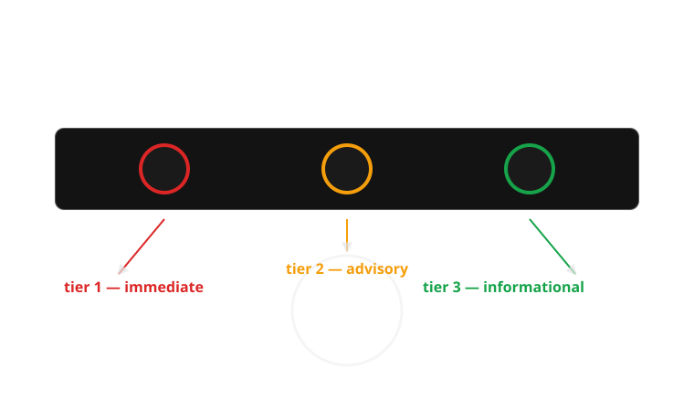
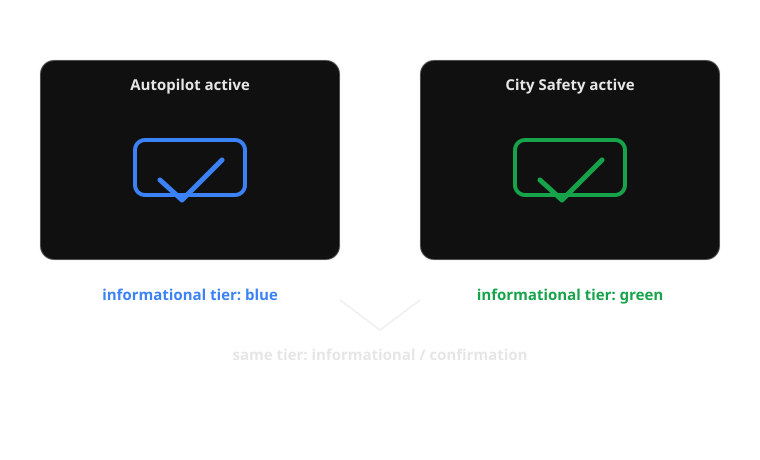

{/* _class: impact */}

# Week 5

## Red, amber, green: the grammar of urgency

How does colour alone encode urgency, and what happens when that code fails?

```notes
Open by asking the room: when you glance at a cluster full of lights, how do
you know which one to worry about first — before you've read any of them?
The answer is colour, and that's the whole week.
```

---

## Learning objectives

By the end of this week you should be able to:

- **Explain** why the SAE/ISO red-amber-green telltale convention was
  borrowed from railway and traffic signalling rather than invented for cars
- **Identify** the three urgency tiers (immediate/hazard, advisory/caution,
  informational/confirmation) and name a real telltale that belongs in each
- **Describe** the sequence of steps — from fault detection to a driver's
  urgency judgement — that a single coloured light compresses into
  milliseconds
- **Compare** a colour-only encoding against a colour+shape+position encoding
  and state which telltales in a real cluster would survive a colour-vision
  failure
- **Explain why** roughly 1 in 12 men have a form of colour-blindness that
  specifically threatens the red/green distinction this whole system depends
  on

---

## Opening example: the half-second scan

Picture a driver starting the car on a cold morning. For about two seconds,
the instrument cluster runs a self-test and every telltale — brakes, oil,
battery, ABS, airbag, seatbelt, TPMS — lights up at once in a wall of red,
amber and green.

The driver does not read this wall. They *scan* it. And within that scan,
without consciously trying, they've already sorted it: is anything **still**
red once the self-test ends? That's the only question that matters, and
colour alone answers it before a single icon has been identified.

---

## Opening example: what the car is actually saying

The self-test isn't showing off — it's proving every bulb still works, so a
burned-out warning light doesn't fail silently later. But the deeper point is
what happens the instant the test ends and real status takes over: the car
has, in that moment, assigned each of dozens of possible faults to one of
three urgency tiers, and it is relying entirely on colour to transmit which
tier applies, faster than the driver could read a single word.

That's the design bet this whole week interrogates: colour as the fastest
channel to the brain, and the single point of failure if that channel is
unreliable for the person reading it.

```notes
Bridge line into the core content: ask "fastest channel to the brain" — why
is that true, physiologically? Rods and colour-opponent cells resolve before
shape recognition does. That's the next section.
```

---

## Why colour, and why it's fast

Peripheral vision resolves colour and motion well before it resolves shape,
detail or text — the fovea (sharp, central, slow) has to be pointed at
something before it can read it, but colour contrast registers across a much
wider field, almost immediately. A dashboard designer exploits this
deliberately: put the *urgency* signal in the fast channel (colour) and the
*diagnosis* signal in the slow channel (icon, text).

This is why a red telltale pulls your eye before you know what it is. The car
isn't being subtle — it's using the fastest wire it has.

---

## Two separate questions, two separate channels

| Question | Channel | Speed | Example |
|---|---|---|---|
| How worried should I be? | Colour | Near-instant, peripheral | Red vs amber vs green |
| What, specifically, is wrong? | Icon / shape / text | Slower, needs foveal attention | Oil can icon, battery icon, "!" in a circle |

Collapsing these into one channel — say, a cluster that used only greyscale
icons with no colour coding — would force every urgency judgement through the
slow channel. Colour is what lets triage happen before comprehension is even
complete.

---

## The process: from fault to judgement

Colour-coded urgency is the visible tip of a chain that starts well before
the dashboard lights up:

1. **Fault detected** — a sensor crosses a threshold (oil pressure drops,
   a wheel-speed sensor disagrees with the others)
2. **Severity classified** — the car's software maps that fault to one of a
   small number of tiers (critical / advisory / informational)
3. **Colour assigned by tier** — critical → red, advisory → amber, 
   informational → green or blue
4. **Telltale illuminated** in that colour, usually alongside its icon
5. **Driver's peripheral vision** registers the colour before foveal vision
   has resolved the icon
6. **Urgency judgement made** — pull over now / note it and carry on / no
   action needed — often before the driver could say out loud which icon it
   was

Every step from 1–4 happens inside the car in milliseconds. Steps 5–6 happen
inside the driver, and step 5 is the one this week is about.

```comment
This flow is the spine of the week — nearly every later slide (the case
study, the colour-blindness failure, the comparison slide) is really asking
"what happens when step 5 fails."
```

---

## The same chain, as a diagram

<div class="dash-flow">
  <div class="dash-flow__step"><span class="dash-flow__step-label">1. Fault detected</span>A sensor crosses a threshold</div>
  <div class="dash-flow__step"><span class="dash-flow__step-label">2. Severity classified</span>Mapped to critical / advisory / informational</div>
  <div class="dash-flow__step"><span class="dash-flow__step-label">3. Colour assigned</span>Red / amber / green or blue, by tier</div>
  <div class="dash-flow__step"><span class="dash-flow__step-label">4. Telltale lit</span>In that colour, usually with its icon</div>
  <div class="dash-flow__step"><span class="dash-flow__step-label">5. Peripheral vision</span>Colour resolves before the icon is identified</div>
  <div class="dash-flow__step"><span class="dash-flow__step-label">6. Judgement made</span>Stop / note it / no action — often pre-verbal</div>
</div>

```comment
Point directly at step 5 here when you get to the colour-blindness case
study a few slides on — it's the one link in this whole chain that can
silently fail, and everything after it in the deck is really about that.
```

---

## Three tiers, not thirty

A dashboard could, in principle, use a wide colour gradient to express fine
shades of urgency — pale yellow through orange through deep red. Almost none
do. The SAE/ISO convention deliberately collapses urgency into exactly three
categories:

- **Red** — immediate attention or hazard: stop as soon as safely possible
- **Amber/yellow** — advisory or caution: attend to it soon, not necessarily
  now
- **Green or blue** — informational or confirmation: a system is on and
  working as intended, no action needed

Three tiers is a cognitive-load decision, not a technical limit. A driver
under time pressure can sort three buckets instantly; they cannot reliably
sort thirty.

---

## Real example: Volvo and the confirmation colour

Volvo's clusters are a useful case because the brand's entire safety
positioning depends on drivers trusting the green/blue tier. When City Safety
or adaptive cruise control is active, the confirmation indicator is
deliberately calm — green or blue, steady, not blinking — precisely so it
never competes visually with a red brake warning two centimetres away on the
same cluster. The colour is doing reputational work as well as functional
work: "the system you paid for is watching" has to look nothing like "stop
the car."

---

## Real example: Toyota's redundant coding

Toyota's Safety Sense telltales are useful for the opposite reason: they
rarely rely on colour alone even within a single tier. A lane-departure alert
pairs its amber/red colour with a distinct icon shape (a car straddling a
lane line) and, on many models, a position on the cluster consistently
reserved for driver-assist status. This matters for this week specifically
because it's a real-world instance of the redundancy the colour-blind failure
case is asking for — Toyota didn't design it for colour-blind drivers
specifically, but it accidentally helps them.

---

## Comparison within the core content: BMW vs Mercedes-Benz

Two premium clusters solve "how much colour work should the cluster do"
differently:

- **BMW's digital clusters** (iDrive-generation) tend to keep the
  red/amber/green telltale bank fixed in position and colour meaning even as
  the rest of the cluster is reconfigurable — urgency colour is treated as a
  constant the driver can always trust regardless of what mode the cluster is
  in.
- **Mercedes-Benz's MBUX clusters** allow more of the display, including some
  status colour, to shift with drive mode (Sport red-tinted themes, Eco
  green-tinted themes) — which risks the ambient colour of the display itself
  competing with the *meaning*-carrying colour of a telltale.

The comparison matters because it shows colour convention can be undermined
by a manufacturer's own styling choices, not only by a driver's vision.

---



*Three colours, three tiers, one glance: the cluster expects urgency to be sorted before any icon is read.*

---

## Real example: Honda's amber "maintenance minder"

Honda's Maintenance Minder is a useful edge case for the amber tier
specifically, because amber is the tier most often stretched to cover things
that aren't really faults at all — a scheduled oil-change reminder uses the
same amber wrench icon as a genuine low-oil-pressure advisory on some
dashboards. This is a real design tension: amber is supposed to mean "attend
to this soon," but a system that cries amber for routine maintenance risks
teaching drivers to deprioritise amber generally, which is a preview of week
10's alarm-fatigue material.

---

## Real example: Tesla and the informational tier

Tesla's instrument display is worth including here because it mostly avoids
green altogether for its informational tier, favouring white or blue text and
icons instead — Autopilot/Full Self-Driving status, for instance, renders in
blue-white rather than green. This is a legitimate variant within the ISO
convention (green *or* blue is permitted for informational/confirmation), but
it also means a driver moving between a Tesla and almost anything else is
relearning which colour means "just letting you know" versus "go."

---



*Same tier, different colour: the ISO standard permits both, but a driver switching cars has to relearn which one means 'no action needed'.*

---

## Case study: a grammar borrowed from the railway

The SAE J209 / ISO 2575 telltale colour convention did not originate with
cars. Red-amber-green as "stop / caution / proceed" was standardised for
railway semaphore signalling in the nineteenth century, and carried into road
traffic lights well before the mass-market dashboard existed. When engineers
in the 1960s and 70s began specifying colours for the first telltale-light
banks (replacing continuous gauges, as covered in week 3), they were not
inventing a code — they were renting one that every literate driver already
carried from the nearest intersection.

This is why the convention needs almost no explanation on a dashboard: red
already meant "stop" to a driver before they ever sat in the car.

---

## Case study: the failure the convention was never designed around

The convention's entire load-bearing distinction — red versus green — is
exactly the pair that fails for the most common form of colour-blindness.
Roughly 1 in 12 men (about 8%), and a much smaller proportion of women
(around 0.5%), have some form of colour-blindness, and the overwhelming
majority of cases are red-green (deuteranopia or protanopia, affecting the
green- or red-sensing cone cells respectively). For these drivers, a red
brake-system warning and a green "system active" confirmation can render as
close to the same washed-out brownish-yellow.

The convention assumed a channel — hue discrimination — that a meaningful
fraction of its actual users do not reliably have.

---

## Case study: what breaks, specifically

For a colour-blind driver, the fast channel described earlier simply doesn't
deliver a triage answer. The peripheral-vision glance that's supposed to
resolve "how worried should I be?" in milliseconds instead resolves to
"something is lit, tier unknown." That driver is pushed straight to the slow
channel — reading the icon, sometimes reading text — under exactly the same
time pressure as everyone else, but without the shortcut the whole system was
built around. The failure isn't cosmetic; it removes the very thing colour
coding exists to provide.

The fix is already latent in the standard: SAE/ISO telltales are also
specified with distinct icon shapes, fill patterns and, on a well-laid-out
cluster, consistent positions by tier. A dashboard that leans on that
redundancy degrades gracefully for a colour-blind driver; one that leans on
colour alone doesn't.

---

## Comparison: normal vision vs deuteranopia, same cluster

| Aspect | Normal colour vision | Deuteranopia (red-green colour-blind) |
|---|---|---|
| Red brake warning | Bright red, unmistakable | Dull yellow-brown |
| Amber engine-check | Amber/orange | Similar yellow-brown — close to the "red" above |
| Green cruise-control confirmation | Green | Also a similar yellow-brown |
| What the glance resolves | Clear tier: stop / caution / fine | All three look nearly identical; tier unresolved |
| What rescues the judgement | Not needed — colour already worked | Icon shape, fill pattern, and position on the cluster, if the manufacturer included them |

The right-hand column is not a hypothetical edge case — it describes the
lived experience of roughly 1 in 12 men on every drive they take.

---


*Run through a red-green colour-blindness simulation, a brake warning and a system-active light can become the same shade.*

---

## This week's channel, against the framework

<div class="dash-panel">
  <span class="dash-panel__label">Colour, against the six-question framework</span>

  It **is** the fastest available proxy for **urgency**, delivered through
  **peripheral** visibility rather than foveal — the whole bet is that it
  works before a driver looks straight at it. Its **meaning** is almost
  entirely pre-learned, borrowed from rail and traffic signalling.
  **Modality** is visual only, which is exactly its failure point.
  **Timing** persists for as long as the tier holds, and the **required
  action** it implies is coarse but immediate: stop, attend, or ignore,
  before any icon is read.
</div>

---

## Common misconception: "if a light is red, every driver reads it as urgent"

Most do. Roughly 1 in 12 men do not — not because they're inattentive, but
because red and green, the two colours this entire system leans on hardest,
render as close to the same washed-out brownish-yellow under the most
common form of colour-blindness. The misconception isn't wrong about most
drivers; it's wrong about treating "most" as "all," on a channel that was
specifically chosen because it's supposed to work without anyone having to
try.

```notes
Callback to the framework slide: the misconception is really a
visibility/modality confusion — colour delivers urgency fast for a driver
whose colour vision works, but the framework doesn't say "for most
drivers," it asks the question for every channel, every week, without an
exception baked in for the common case.
```

---

## Classroom exercise: audit a cluster for colour-only risk

Working from a real dashboard photo (yours, a classmate's, or a manual
image), identify every telltale that is currently distinguished from its
neighbours by colour *alone* — no difference in icon shape, fill, blinking
pattern, or position that would survive if all the colours became identical.

Discuss in pairs:

1. Which telltale pairs on this cluster would become ambiguous under
   deuteranopia?
2. For each ambiguous pair, is there an unused shape, position or animation
   cue that could disambiguate them without adding colour?
3. Is there a telltale here where colour is doing real work that text or
   shape genuinely couldn't replace as fast?
4. If you had to redesign one telltale on this cluster for colour-blind
   accessibility without removing colour for everyone else, what would you
   change?

```notes
Sample direction for discussion: most groups will find that brake/battery/
oil telltales usually already have distinct icon shapes (good), but that
confirmation lights (cruise control, seatbelt-fastened, DRL-on) are often the
worst offenders — small, colour-only, low-contrast icons that were designed
assuming the colour tier alone was legible. Push groups toward proposing
position as the cheapest fix: a fixed "problem zone" on the left of the
cluster reserved for anything red-tier, regardless of colour rendering.
```

---

## Exercise debrief: a model answer

Two answer-shapes cover most audits:

1. **Telltales that already survive colour loss** — brake, battery and oil
   warnings usually have distinct icon shapes layered on top of colour, so
   even under deuteranopia the shape alone still resolves which fault it is.
2. **Telltales that don't** — confirmation lights (cruise control active,
   seatbelt fastened, daytime-running-lights on) are the recurring
   offenders: small, colour-only, low-contrast icons designed as if the
   colour tier alone would always be legible.

The real constraint being tested: redundancy has to be built in at design
time, because a colour-blind driver can't add shape or position back to an
existing telltale themselves. The cheapest fix groups often land on is
reserving a fixed cluster *position* — a "problem zone" — for anything
red-tier, so tier is recoverable from where a light is, not only its hue.

```notes
Harder unresolved question to leave the room with: is it the
manufacturer's job to test every telltale against a colour-blindness
simulation before shipping, or does that responsibility belong to the
regulator writing the ISO/SAE standard in the first place?
```

---

## Mini knowledge check

1. Where does the red-amber-green telltale colour convention originally come
   from, and why does that history matter for how quickly drivers learn it?
2. Name the two colours that are hardest to distinguish for the most common
   form of colour-blindness, and explain why it's a problem that those are
   exactly the two colours the SAE/ISO convention relies on most.
3. A telltale is amber, has a unique icon shape, and always appears in the
   same position on the cluster. If a driver can't perceive its colour at
   all, can they still identify its urgency tier? Why or why not?
4. Give one real manufacturer example from this week where colour convention
   is used well, and one where it's stretched thin.

```notes
Q1: railway/traffic signalling — drivers arrive already knowing the code.
Q2: red and green (deuteranopia/protanopia) — exactly the pair the standard
depends on for its two most-used tiers (critical vs informational).
Q3: partially — shape and position carry tier information independent of
colour, but only if the driver already knows the shape/position convention;
it's slower than colour but not zero information.
Q4: any reasonable pairing works — e.g. Toyota's shape+colour redundancy
(used well) vs Honda's amber overloaded for both faults and routine
maintenance reminders (stretched thin).
```

---

## Summary

- Colour is the fastest channel to a driver's attention — faster than icon,
  faster than text — which is why it's used to carry urgency, not detail
- The SAE/ISO red-amber-green convention wasn't invented for cars; it's
  inherited from railway and traffic signalling, which is exactly why it
  needs no explanation
- That inheritance has a cost: it puts the whole urgency signal on the one
  hue distinction — red vs green — that fails for the most common form of
  colour-blindness, affecting roughly 1 in 12 men
- Shape, fill pattern and cluster position are the standard's own redundancy
  mechanism, already specified but inconsistently used
- A well-designed telltale degrades gracefully when colour fails; a
  colour-only telltale simply stops working for a meaningful fraction of
  drivers

---

## Bridge to week 6: when colour isn't available at all

Colour has one hard limit this week didn't get to: it only works if the
driver is looking at the dashboard *at all*. Eyes on the road, at night,
in glare, or with a colour-vision deficiency — colour can fail or simply not
reach the driver in time.

Week 6 picks up exactly where this week's failure case leaves off: sound as
a second, independent channel for urgency — one that doesn't require looking
anywhere. Idris teaches it, and the seatbelt chime's mandated escalation is
the case study: a system that gets louder and more insistent specifically
because it can't rely on being seen.

```notes
Explicit hand-off line for students: "everything colour does in this week's
model — carry urgency faster than comprehension — sound can also do, and it
doesn't need your eyes." That's the whole bridge.
```

---

{/* _class: impact */}

## Next: Week 6 — Chimes, dings and voices

The sonic register — a channel that reaches the driver whether or not they're
looking, and whether or not they can see colour at all.
