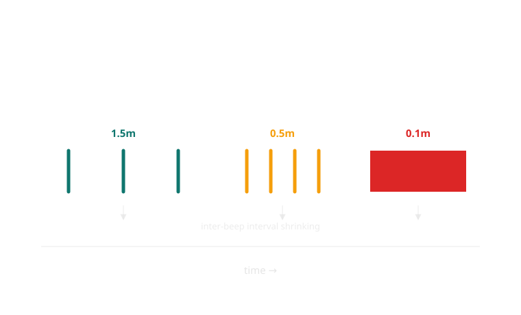
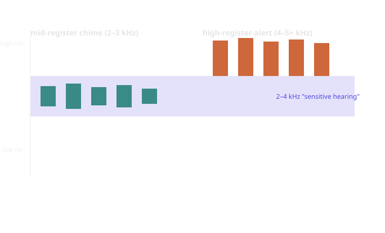
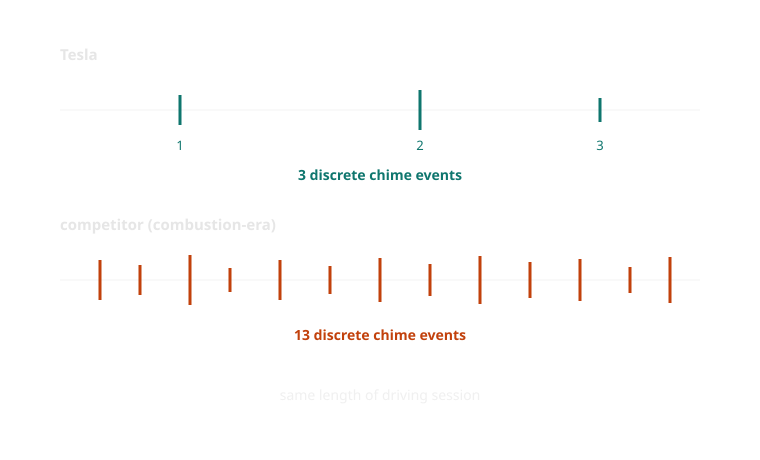

{/* _class: impact */}

# Week 6

## Chimes, dings and voices: the sonic register

**Guiding question:** What makes a sound urgent without becoming alarming,
and who decides where that line sits?

```notes
- Open by asking the room to notice the room: HVAC hum, laptop fans,
  someone's phone on silent-but-vibrating. We already live inside a sonic
  register; a car is just a more consequential version of the same problem.
- This is my week. Say why up front: sound design background, not
  automotive human factors — that's the point of the substitution today.
```

---

## Learning objectives

By the end of this week you should be able to:

- **Identify** the four independent variables a warning sound designer
  controls (pitch, tempo, repetition, timbre) in a real dashboard chime
- **Explain why** volume alone is an unreliable signal of a warning's
  actual urgency
- **Compare** the seatbelt chime's regulatory escalation against Tesla's
  minimal chime philosophy and state what each implies about trusting the
  driver
- **Describe** the pipeline that turns a detected event into a played
  sound, including where driver non-response re-enters the loop
- **Distinguish**, for a given alert, whether its sound design matches the
  real stakes of what it signals or over/under-states them

---

## Opening example: the sound you can't look away from

A red telltale only works on a driver already looking toward the
instrument cluster. A chime doesn't need that. It reaches a driver
checking the mirror, glancing at a child in the back seat, eyes fully on
the road ahead — anywhere except the dashboard.

That's the entire appeal of the sonic register: it is the one channel that
doesn't require the driver's eyes. It is also the entire risk. A sound
that reaches you regardless of where you're looking also doesn't stop
just because you'd like it to — and a driver who has learned to tune a
chime out has lost the one warning channel built to work no matter where
their attention was.

---

## Opening example, continued: the parking sensor that speeds up

Reversing toward a wall, most cars produce a beep that gets faster as the
gap closes — slow ticks at a metre and a half, a near-solid tone at ten
centimetres. Nobody has to be told what a faster beep means; the mapping
from tempo to distance is learned in seconds, almost certainly the single
most intuitive piece of sound design on the entire dashboard.



*Distance is encoded entirely in tempo — the beep doesn't get louder, it gets more frequent, until frequency itself becomes a constant tone.*

```comment
Leading with parking-sensor tempo before naming the four variables lets
students discover "tempo = distance" for themselves before it's labelled,
rather than being handed the taxonomy cold.
```

---

## The mistake: treating loudness as a proxy for importance

The easy assumption is that louder means more urgent. It doesn't,
reliably. A car can be quiet about something serious and insistent about
something merely inconvenient:

- a single, modest chime for a cracked windscreen sensor fault
- a loud, repeating chime for a door held slightly ajar at low speed

If loudness tracked real stakes, these would be reversed. They aren't,
because loudness is only one of several variables a sound designer sets —
and it's usually tuned for audibility inside a moving cabin, not for
communicating rank among warnings.

---

## Four variables, not one dial

A warning sound is not "how loud." It is at minimum four separate,
independently controllable decisions:

| Variable | What it can encode |
|---|---|
| **Pitch** | perceived pressingness — higher generally reads as more urgent, up to a threshold past which it reads as a system error rather than a warning |
| **Tempo** | proximity or immediacy — a faster repeat rate reads as "closer," the same logic as a Geiger counter |
| **Repetition** | whether the situation is resolved — does it sound once, or does it keep returning until the driver acts |
| **Timbre** | register — a synthesized tone, a recorded voice, and a two-note consumer-electronics "earcon" all carry different social weight even at matched loudness |

A driver doesn't need to name these to feel the difference between two
chimes of identical volume. Naming them is what lets a designer choose
which one to use on purpose.

---

## Pitch: pressing, but only up to a point

Higher pitches are read, cross-culturally, as more attention-demanding —
which is why almost every dashboard alert sits well above the frequency
range of engine and road noise, typically in the 2–4 kHz band where human
hearing is most sensitive. Push pitch too high, though, and a warning
stops reading as "urgent" and starts reading as "broken": a shrill,
piercing tone gets dismissed as a fault in the speaker rather than a
message about the car. The usable range is narrower than it looks.



*Both tones sit inside the ear's most sensitive range — the difference in how 'urgent' versus 'broken' they feel is pitch alone, not loudness.*

---

## Tempo and repetition: the difference between "once" and "still"

Tempo (how fast a sound repeats) and repetition (whether it repeats at
all) look similar but do different jobs. Tempo encodes proximity or rate
of change — the parking sensor again. Repetition encodes state: a chime
that sounds once and stops is reporting an event that has passed (a door
was opened); a chime that keeps returning is reporting a condition that
persists (a door is still open). Conflating the two is a common design
failure — a single-shot chime for an ongoing hazard tells the driver
something happened, when the car actually needs to say something is still
true.

---

## Timbre: tone, earcon, or voice

The same information can be delivered as a synthesized tone, a short
melodic "earcon" borrowed from consumer-electronics sound branding, or a
recorded/synthesized human voice reading out the fault. These are not
interchangeable stylistic choices — they carry different implied
relationships between car and driver.

**Direct comparison:** a tone says "something is true, look at the
screen to find out what"; a spoken alert ("Please fasten your seatbelt")
says the same thing without requiring the driver to look at anything at
all, at the cost of taking roughly ten times as long to deliver and
being far harder to localise in shared attention (a voice competing with
passenger conversation is a genuinely different cognitive load than a
tone doing the same). Manufacturers that add voice alerts (many premium
marques' navigation and safety-system voices) are trading speed and
universality for the ability to be unambiguous about *what*, not just
*that*.

---

## Real example: Audi, VW, Toyota — convergence without coordination

The tempo-encodes-distance parking-sensor beep described earlier isn't
one manufacturer's invention — it appears in near-identical form across
Audi, Volkswagen, and Toyota reversing systems, among many others, despite
no shared regulatory mandate forcing the convergence (unlike week 4's
tyre-pressure icon). It's a useful case precisely because it shows sonic
convergence can happen through user intuition and competitive
copying alone, without a standards body — a contrast worth holding
against the seatbelt chime case study, which converged under explicit
regulatory pressure instead.

---

## Real example: BMW's Hans Zimmer collaboration (IconicSounds Electric)

BMW commissioned composer Hans Zimmer to design the ambient interior and
exterior sound identity for its electric vehicles under the
"IconicSounds Electric" programme — not warning tones, but the
low-level ambient sound the car makes simply existing and accelerating.
It's useful here because it's the clearest case of a manufacturer
treating cabin sound as brand identity rather than function, which
throws the *functional* chime work of this week into relief: a startup
chime is doing marketing; a seatbelt chime is doing compliance; both
live in the same interface, and a driver has to be able to tell which is
which without being told.

---

## Real example: the regulator-mandated EV pedestrian sound (AVAS)

Electric and hybrid vehicles are quiet enough at low speed to be a
pedestrian-safety hazard, so regulators (UN Regulation No. 138 in Europe,
NHTSA's Minimum Sound Requirements for Hybrid and Electric Vehicles in
the US, both taking effect around 2019–2020) mandate an Acoustic Vehicle
Alerting System: a synthesized sound played below roughly 20 km/h so
pedestrians can hear the car coming. It's useful for this week because
it's a sound engineered for someone *outside* the car entirely — a
reminder that not every sound on this week's list is designed for the
driver, and the same four variables (pitch, tempo, repetition, timbre)
still apply to an audience that never sees a dashboard.

---

## Silence is also a decision

A cabin engineered to be very quiet (heavy sound-deadening, no engine
note reaching the driver) removes an entire ambient channel of
information older drivers relied on without realising it — the sound of
the engine labouring was itself a continuous, un-flagged warning about
load and gear choice. Removing that ambient sound doesn't remove the
need for the information; it just means something else, usually a
discrete chime or a digital gauge, now has to say explicitly what the
engine note used to say for free.

---

## Process: how a warning sound actually gets deployed

A chime doesn't just "go off." It moves through a pipeline:

1. **Event detected** — sensor reports an unbuckled belt, a closing gap,
   a lane departure
2. **Urgency tier assigned** — the event is classified against a fixed
   severity scale set during development, not decided in the moment
3. **Palette queried** — the tier maps to a specific pre-recorded or
   synthesized sound from the manufacturer's sound-design library
4. **Sound played** — at the volume, pitch, and repetition rate that
   tier specifies, not whatever the engineer on duty feels like
5. **Response monitored** — if the triggering condition doesn't clear
   (belt still unbuckled, gap still closing), the system may escalate:
   louder, faster, or paired with an additional channel (haptic seat
   buzz, flashing telltale)

Step 5 is where this week's case study lives: how aggressively a system
is allowed to escalate at step 5 is a policy decision, not a technical
one.

---

{/* _class: banner */}

## Case study: two philosophies for step 5

**Escalate hard, or don't escalate at all —**
the seatbelt chime versus Tesla's chime set

---

## Case study: the seatbelt chime under regulatory pressure

The seatbelt chime is one of the oldest mandated sounds on the
dashboard, and testing regimes have spent two decades pushing it in one
direction. Protocols used by NHTSA's New Car Assessment Program and Euro
NCAP's Safety Assist criteria award manufacturers credit for seatbelt
reminder systems that escalate: not a brief courtesy ding, but a chime
that gets louder and more frequent, paired with a flashing telltale, the
longer the belt stays unbuckled while the vehicle is moving. Some systems
extend this to rear seats, and some repeat indefinitely rather than
timing out.

**Design intent:** make ignoring the belt actively unpleasant, because
measured compliance improves when the nag gets worse. **Strength:** it
works — escalating reminders measurably increase belt-wearing rates.
**Weakness:** the same design brief that makes it effective on a
resistant driver makes it grating for a driver who was always going to
buckle up, and grates hardest exactly on the people it doesn't need to
persuade.

---

## Case study: Tesla's comparatively minimal chime set

The seatbelt chime is federally mandated — Tesla can't remove it — but
Tesla generally doesn't layer the escalating loop many competitors add
once that legal minimum has played. Status that would be an ongoing
sound elsewhere (unbuckled belt, open door while parked, various
system states) is instead represented as a persistent but silent icon or
line of text on the central touchscreen. The chime library as a whole is
sparse compared with a typical combustion-era competitor's, which
usually runs to dozens of distinct alert sounds across systems.



*Same length of driving, a fraction of the sound events — the difference isn't one missing chime, it's an entire design philosophy about how often the car should speak.*

**Design intent:** treat the driver as someone who, once told, doesn't
need to be told again at increasing volume. **Strength:** far less
chime fatigue — the sounds that do play are more likely to still mean
something. **Weakness:** a system that relies on the driver *choosing*
to look at the screen re-introduces the exact problem sound was supposed
to solve — it stops working the moment the driver isn't looking.

```notes
Ask directly: which design do you trust more as a driver, and which
would you trust more as a regulator writing a five-year mandate for
every manufacturer, not just the ones whose customers already buckle up?
Those are different questions with different right answers.
```

---

## Case study synthesis: neither philosophy is free

The escalating chime buys measurable compliance at the cost of treating
every driver as if they need to be worn down. The minimal chime buys
respect for the attentive driver at the cost of quietly depending on
attention it can't guarantee. A synthesis worth proposing in class: tier
the escalation to *behaviour*, not just elapsed time — a system that
starts minimal (a short, low chime plus a screen icon) and only
escalates toward the loud, repetitive, regulator-favoured version if the
driver has demonstrably not glanced at or dismissed the alert, rather
than escalating on a fixed clock regardless of whether the driver has
already noticed.

```comment
This synthesis slide exists so the case study doesn't end on "regulator
good, Tesla bad" or vice versa — the point of the week is that both are
legible, defensible bets about trust, not that one is simply correct.
```

---

## Comparison: maximally insistent vs minimal

| Dimension | Maximally insistent (regulator-favoured) | Minimal (Tesla-style) |
|---|---|---|
| Repetition rate | Repeats on a fixed cycle regardless of driver behaviour | Sounds once at the mandated minimum, then stops |
| Volume escalation | Increases over time if belt stays unbuckled | None beyond the fixed mandated level |
| Channels used | Audio + flashing telltale, sometimes haptic | Audio once, then screen icon/text only |
| Driver annoyance | High for already-compliant drivers | Low, but only for drivers who check the screen |
| Compliance on resistant drivers | Measurably higher | Untested advantage — depends on screen-glancing |

---

## Exercise: redesign one chime's escalation policy

Pick one dashboard alert from this week's studio listening set (seatbelt,
low-fuel, lane-departure, or parking-proximity) and design its
escalation policy from scratch — not the tone itself, just the rules
for when it gets louder, faster, or stops.

Answer, in writing:

1. What event triggers the first sound, and how long does that first
   sound last?
2. What condition causes it to escalate — elapsed time, driver
   non-response, or something else you can detect?
3. What does escalation actually change: volume, tempo, repetition,
   or an added channel?
4. What condition makes it stop, and can it stop even if the underlying
   problem hasn't been fixed?

```notes
Sample direction, don't hand this out verbatim: lane-departure warnings
are a good one to assign because most current systems already escalate
via haptic (steering-wheel vibration) rather than volume — a chance to
notice that "escalate" doesn't have to mean "louder," it can mean
"switch channel entirely." Push groups that default to "just make it
louder" to justify why volume is the right lever versus tempo,
repetition, or channel change.
```

---

## Mini knowledge check

1. Name the four independent variables a chime designer controls, and
   give an example of a dashboard sound where one of them, not volume,
   is doing the real work of signalling urgency.
2. A single-shot chime is used for a condition that persists (say, a
   door still ajar). What's the mismatch, and what should have been used
   instead?
3. Explain, in one sentence each, what the escalating seatbelt chime
   assumes about the driver, and what Tesla's minimal chime set assumes
   instead.
4. Give one real example (from this deck or elsewhere) of a sound
   designed for someone outside the car rather than the driver.

```notes
Answer guidance: (1) parking sensor — tempo, not volume, encodes
distance. (2) mismatch is repetition vs state — a single-shot sound
reports an event, an ongoing sound reports a persisting condition; a
repeating chime or persistent icon was needed. (3) escalating chime
assumes the driver needs pressure to comply; Tesla's set assumes the
driver, once told, will act without repeated pressure. (4) AVAS/EV
pedestrian warning sound.
```

---

## Summary

- Urgency is communicated by at least four independent variables — pitch,
  tempo, repetition, timbre — not by loudness alone
- Tempo often encodes proximity or rate of change; repetition encodes
  whether a condition is ongoing, not merely that an event occurred
- A warning sound moves through a real pipeline: event, tier, palette,
  playback, and — critically — a possible escalation step keyed to
  driver response
- The seatbelt chime's regulatory escalation and Tesla's minimal set are
  both legible, defensible bets about how much trust to extend to the
  driver, not one correct design and one wrong one
- Not every sound in a car is designed for the driver — AVAS pedestrian
  sound and brand-identity ambient sound (BMW/Zimmer) answer to
  different audiences with the same four variables

---

## Bridge to next week: what a sentence can say that a chime can't

A chime can tell a driver *that* something is wrong and roughly *how
urgently* to respond. It is much worse at telling them *what*, exactly,
without training beforehand — which is why multi-info displays
increasingly resolve the ambiguity a tone leaves open by simply writing
it out: "Low tyre pressure — front left," not a beep the driver has to
already know how to decode. Next week asks what changes when the
dashboard stops gesturing at meaning and starts stating it directly in
words, and what that plain-language shift costs once it has to be
translated into every market the car is sold in.

---

{/* _class: impact */}

# Same event. Different bet on the driver.

That's the whole week: a chime, a beep, a voice — each one a decision
about how much pressure a car is allowed to put on the person driving it.

```notes
Closing line, said out loud rather than read from the slide if possible:
"the loudest car in the room isn't the most honest one — it's just the
one that trusts you least."
```
