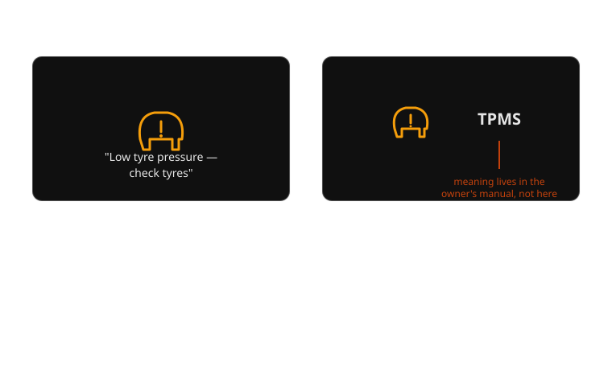
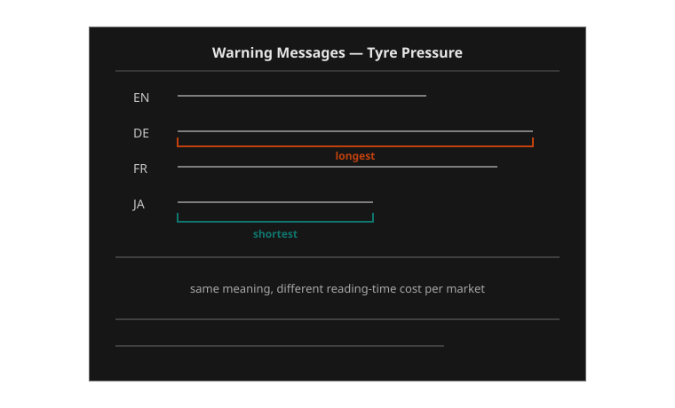

{/* _class: impact */}

# Week 7

## From acronym to sentence: text on the dashboard

What can a sentence say that an icon can't, and what does it cost to say it?

```notes
Open by pointing at the guiding question directly. Don't define "telltale"
yet — that comes from the examples. The whole week hinges on this being a
trade, not an upgrade: sentences are strictly better at one thing and
strictly worse at another, plus they create a cost icons never had at all.
```

---

## Learning objectives

By the end of this week you should be able to:

- **identify** an acronym-and-icon telltale versus a plain-language
  multi-information display message for the same underlying fault
- **explain why** reading a sentence costs more driver attention than
  recognising an icon, in terms of foveal versus peripheral vision
- **compare** icon-only, icon-plus-acronym and full-sentence messages across
  reading time, ambiguity and translation cost
- **describe** the localisation problem a text message introduces that a
  pictogram is structurally immune to
- **propose** a synthesis design (e.g. icon-plus-short-text) and state which
  problem it solves and which it doesn't

---

## Opening example: the light that used to send you to the manual

A driver in 2004 sees a small tyre-pressure icon light up on the cluster,
next to the letters `TPMS`. Nothing else. To find out what that means, they
either already know the acronym, or they pull over and open the glovebox.

A driver in the same car's 2024 equivalent sees, on the multi-information
display between the gauges: **"Low tyre pressure — check tyres."** No lookup
required. The message is the meaning.

---

## Why this example carries the week

Both drivers received the same underlying signal — a pressure sensor
crossing a threshold. The car's engineering didn't change; its *language*
did. The 2024 driver spent longer with their eyes on the display to read
eight words than the 2004 driver spent recognising one icon shape — but the
2004 driver, unless they already knew `TPMS`, learned nothing actionable at
all in that glance. This is the trade the whole week is about: a sentence
can't be ambiguous the way an icon can, but it can't be free the way an icon
almost is, either.

```notes
Flag "almost free" — icon recognition still costs something, just much less
and mostly pre-attentively. Don't let students round it down to zero.
```

---

## An icon is a compressed hypothesis

An icon is a bet: that the driver has already learned, somewhere else, what
this shape means. A thermometer over a wavy line is a bet that "coolant
temperature" is already wired into the driver's head. When the bet pays off,
recognition is close to instant and happens in peripheral vision, before the
driver has consciously "read" anything. When the bet doesn't pay off — a
new driver, a rental car, an unfamiliar model — the icon delivers nothing.
It fails silently. The driver doesn't know they've missed the message; they
just see a shape they don't recognise and move on.

---

## A sentence collects on every bet at once

A sentence doesn't ask the driver to have learned anything in advance. "Low
tyre pressure — check tyres" means what it says, to a first-time driver in a
rental car exactly as well as to the vehicle's owner of ten years. That is
the entire value proposition of text on a dashboard: it trades a
probabilistic recognition event for a guaranteed comprehension event,
*provided the driver can read the language it's written in* — a proviso an
icon never needs.



*Same fault, two eras of dashboard language: a code to look up, or a sentence to read.*

---

## The cost: foveal vision is slow and serial

Peripheral vision resolves shape and colour fast, in parallel, without
requiring the eye to fixate on anything. Reading text requires foveal
vision — the eye has to physically point at the words, and it processes
them one at a time, left to right (or right to left, depending on the
locale). In-vehicle human-factors studies on glance behaviour consistently
find that reading a short in-cluster message measurably increases eyes-off-
road time compared with recognising a symbol conveying the same underlying
alert. For a driver, eyes-off-road time is the resource in shortest supply
exactly when a warning is worth reading at all.

---

## Putting a number on the glance

NHTSA's visual-manual distraction guidelines for in-vehicle interfaces set
concrete thresholds precisely because glance time is measurable and
dangerous past a point: a single glance should stay at or under about two
seconds, with total eyes-off-road time for one task capped at around
twelve seconds. Recognising an icon typically clears that bar without even
approaching it. A multi-clause sentence, especially one requiring a second
glance to finish reading, can approach or cross it — which is exactly why
manufacturers converge on short, single-clause MID messages rather than
paragraph-length explanations, no matter how much more precise a longer
message could be.

---

## Two variables in tension, not one design goal

It's tempting to treat "make the message clearer" as a single objective.
It isn't — clarity and reading time pull against each other:

- **Comprehension accuracy** rises as a message gets more specific: naming
  the fault, the affected system, the recommended action
- **Reading time** rises with every word added to reach that specificity

A designer choosing between `TPMS` and "Low tyre pressure in the front left
tyre — check and inflate to the recommended pressure shown in the door
sill" is choosing a point on that curve, not a right answer. The
multi-information display convention that won out — short, plain,
one-clause sentences — is a deliberate compromise point, not the ceiling of
what text could say.

---

## Real example: BMW Check Control, text before it was fashionable

BMW's Check Control system, introduced on the E32 7 Series in 1986, is
worth knowing because it is one of the earliest production systems to
commit to full written messages instead of expanding the icon set: instead
of adding more telltales for more faults, it added a small text display and
a voice module that could say things like "brake pads worn" or "engine oil
level low" outright. It matters for this week because it shows the acronym-
to-sentence shift isn't a 2020s multi-information-display phenomenon at
all — the trade-off has been live, and being actively designed around, for
close to forty years.

---

## Real example: Volvo's messages that explain a judgement, not just a fault

Volvo's driver-support messages (in Sensus and its successors) are useful
here because several of them aren't reporting a mechanical fault at all —
they're narrating an assessment. A driver-fatigue message reads along the
lines of "You seem tired. Consider taking a break," recommending a coffee
cup icon and a rest-stop suggestion. No icon vocabulary could carry that
content: there's no pictogram for "the car's inference about your alertness
level," only a sentence can. This previews a problem week 9 returns to
directly — messages that have to explain a car's *decision*, not just a
sensor reading.

```notes
Light touch here — don't let this become week 9's lecture early. The point
for week 7 is narrowly: some messages are only possible as sentences, full
stop, regardless of reading-time cost, because there is no icon for them.
```

---

## Real example: the hybrid middle ground — Audi's virtual cockpit

Audi's digital instrument cluster (and comparable systems from Volkswagen)
is a useful counter-example because it doesn't choose fully between icon and
sentence — it pairs a small icon with a short text label underneath it,
simultaneously, on the same display. "Low tyre pressure" appears as text
directly beside the tyre icon, rather than replacing it. This is the
synthesis the case study below argues for: keep the icon's near-instant
peripheral recognition, and let the short text resolve exactly the
ambiguity the icon alone couldn't.

---

## Real example: the same manufacturer, forty years apart

Mercedes-Benz is a useful bookend because you can watch the whole shift
happen inside one badge. A 1985 W124-generation cluster communicates
almost entirely through icon telltales and a handful of analogue gauges —
no message strings at all, by design; the electronics of the era simply
had nowhere to put one. The 2021 MBUX Hyperscreen cluster from week 1
communicates the same categories of fault as full plain-language
notifications, rendered on a screen that didn't exist as a dashboard
component when the W124 was drawn. The fault categories barely changed in
forty years — low oil pressure is still low oil pressure. What changed was
entirely the display technology's capacity to render a sentence at all.

```notes
Callback to week 1's E-Type/Hyperscreen framing on purpose — same
manufacturer here instead of two different ones, to isolate that the
driver, the road and the fault categories are constant across this
comparison; only the display technology changed.
```

---

## The process: how a fault becomes a sentence you read

1. **Fault detected** — a sensor crosses a threshold (tyre pressure,
   coolant temperature, brake-pad wear)
2. **Message selected** — the system looks up the fault code in a
   localisation table keyed to the vehicle's set market/language
3. **String rendered** — the matching sentence is drawn from that table and
   displayed in the driver's configured locale
4. **Driver reads and comprehends** — a step an icon skips entirely; this
   is where foveal, serial reading happens
5. **Driver acts** — pulls over, checks tyres, books a service

---

## Where the reading-time cost actually lands

| Stage | Icon-only path | Sentence path |
|---|---|---|
| 1–2 (detect, select) | identical | identical |
| 3 (render) | render one shape | render and lay out a full string, sized to fit the panel |
| 4 (comprehend) | pre-attentive, sub-second | foveal, serial — hundreds of milliseconds per word |
| 5 (act) | identical, if step 4 succeeded | identical |

The two paths are identical everywhere except step 4 — and step 4 is
exactly where the icon path can fail silently (unrecognised shape) while
the sentence path succeeds slowly. Neither failure mode is free; they're
just different currencies.

```comment
This table is the load-bearing slide of the deck: it's the one place the
"reading time vs. comprehension accuracy" trade gets made mechanically
concrete instead of asserted. Keep it on screen while narrating the process
list above it — the table is what students should still be looking at
during the exercise later.
```

---

## Case study, part 1: the original — icon plus acronym

Across the industry after tyre-pressure monitoring became a mandated
feature (following the US TREAD Act, and comparable EU rules from 2014),
the near-universal cluster convention was a small warning icon plus an
acronym — `TPMS`, or a manufacturer-specific code. **Design intent:** fit
the alert into a seven-segment or single-icon budget that predates any
real onboard screen; keep the message language-neutral by never using
words at all. **Strength:** ships identically to every market, no
translation required, ever. **Weakness:** the acronym itself is not
self-explanatory — a driver has to have already learned it, from a manual
they may have never opened.

---

## Case study, part 2: the sentence — plain language on the MID

Once vehicles carried an actual multi-information display, manufacturers
began replacing the acronym with a full clause: "Low tyre pressure — check
tyres," sometimes naming the specific wheel position. **Strength:**
immediately comprehensible to a first-time driver, no prior exposure to
any code required. **Weakness:** costs more reading time than the icon it
replaced, and — the problem this case study exists to introduce — every
one of those sentences now has to be written, and rewritten, in every
language the vehicle is sold in.

---

## Case study, part 3: the bill that arrives with the sentence

A pictogram means the same thing in Munich, Osaka and São Paulo without
anyone touching it twice — ISO 2575 exists precisely so that a tyre-cross-
section-plus-exclamation-mark icon never needs a translator. A sentence has
no such immunity. "Check tyres," translated too literally or by a
contractor without automotive-domain context, can come out vague, overly
alarming, or simply wrong in the target language — a mistranslated message
can introduce *new* ambiguity in exactly the spot the sentence was
supposed to remove it. That is a real, ongoing cost line for every market a
manufacturer enters, one an icon-only system never had to budget for at
all. **Suggested synthesis:** pair the icon with a short, tightly-controlled
text string (Audi's virtual-cockpit pattern) — the icon still recognises
instantly and language-neutrally, and the text only has to disambiguate,
not carry the whole message alone, which shrinks the translation surface
without giving up its benefit.



*The pictogram above this table didn't need this page. The sentence did.*

---

## Comparison: three designs, one fault

| Dimension | Icon only | Icon + acronym | Full sentence (MID) |
|---|---|---|---|
| Reading time | near-zero (pre-attentive) | low, if code is known | higher — full clause, foveal reading |
| Ambiguity if unfamiliar | high — meaning entirely lost | high — code is opaque without lookup | low — self-explanatory |
| Translation cost | none | none (codes stay in Latin letters) | recurring, per market, per model year |
| Failure mode | silent miss | silent miss, or wrong lookup | slow read, or mistranslation |

No row in this table is free. The industry's actual trajectory — icon, to
icon-plus-acronym, to full sentence, to icon-plus-short-text — reads as a
slow search for the least-bad point on this table, not a discovery of a
perfect design.

---

## Exercise: rewrite a fault three ways

Pick one dashboard fault (tyre pressure, coolant temperature, or brake-pad
wear). Working alone or in pairs:

1. Write the icon-only version: describe the pictogram you'd use and
   nothing else
2. Write the icon-plus-acronym version: invent a plausible 3–4 letter code
3. Write the full-sentence MID version: one clause, no more than ten words
4. Translate your sentence version into a second language, then translate
   it back — note anywhere the round trip changed the meaning

Discuss: which version would you want if you were a first-time renter in an
unfamiliar car? Which would you want if you'd owned the car for ten years?

```notes
Sample discussion direction: experienced owners often prefer the acronym or
icon precisely because they've already paid the learning cost once and now
want speed back; first-time/rental drivers need the sentence regardless of
its cost. This is a genuine argument for making the message length
user-configurable rather than fixed — some manufacturers already let
owners toggle a "detailed messages" setting, which is effectively letting
the driver pick their own point on the comparison table.
```

---

## Mini knowledge check

1. Name one thing a full-sentence dashboard message can do that an icon
   structurally cannot.
2. Why does reading a message cost more driver attention than recognising
   an icon, in terms of the visual system involved?
3. A manufacturer selling one model in twelve languages adds a new
   plain-language warning message. What new cost did they just take on that
   an icon-only warning would not have created?
4. Propose one design that keeps most of a sentence's clarity while
   reducing its reading-time and translation cost.

```notes
1. Removes ambiguity for a driver with no prior exposure to a code; can
   narrate a judgement (Volvo fatigue example) that has no pictogram at all.
2. Icons are processed by fast, parallel, pre-attentive peripheral vision;
   text requires foveal fixation and serial, word-by-word reading.
3. A recurring translation and localisation-QA cost, repeated for every
   market/language and maintained across model years — plus the risk of a
   mistranslation introducing new ambiguity.
4. Icon-plus-short-text (Audi virtual cockpit pattern), or a user-toggleable
   message-length setting, or reserving full sentences only for faults with
   no existing icon vocabulary.
```

---

## Summary

- An icon is a compressed bet on prior learning; a sentence collects on
  every bet at once, at the cost of reading time
- Reading time and comprehension accuracy trade against each other — there
  is no zero-cost way to make a message more specific
- Some content (a car narrating a judgement, not just a fault) has no
  icon form at all — only a sentence can carry it
- A sentence introduces a cost an icon structurally never had: recurring,
  per-market translation, with its own risk of new ambiguity
- Icon-plus-short-text is not a compromise of convenience; it's a deliberate
  point chosen on the reading-time/ambiguity/translation-cost table

---

## Bridge to week 8

Every design this week still asked the driver to look down and in — at a
cluster or a multi-information display below the windscreen line. Next
week the message moves again: a heads-up display projects text and icons
directly onto the driver's forward view, so reading a warning no longer
means taking your eyes off the road at all, only refocusing them. The same
reading-time-versus-glance-time argument from this week returns, but with
the eyes-off-road variable itself redesigned out of the equation — worth
testing whether it actually is.

---

{/* _class: impact */}

## Next week: heads-up

Putting the dashboard on the windscreen.

Assessment 2, *Redesign a Warning*, is due at the end of week 8.
