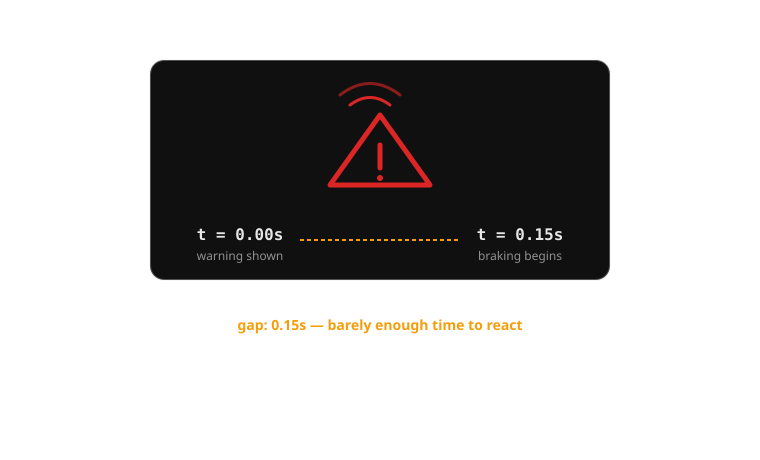
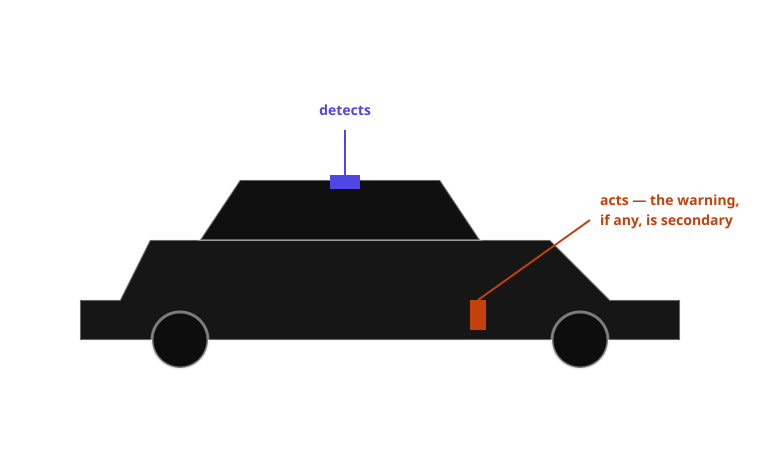

{/* _class: impact */}

# Week 9

## The vocabulary of almost-autonomy

When the car starts giving advice instead of just reporting state, what is
the alert actually claiming?

From symptom to decision: the first dashboard sentence about the car's own
agency.

```notes
Open by asking the room: "when was the last time your car did something to
the controls without you asking it to?" Most hands go up for either a
lane-keep nudge or an automatic-braking event. Hold that answer — it's the
opening example on the next slide.
```

---

## Learning objectives

By the end of this week you should be able to:

- **distinguish** an alert that reports a state of the world from one that
  narrates a decision the car itself is making
- **explain why** Volvo's City Safety (2008) is a turning point in dashboard
  vocabulary, not just an early example of automatic braking
- **identify**, given a real ADAS alert, which category it belongs to and
  justify the classification in one sentence
- **compare** two manufacturers' interface treatments of the same underlying
  warn-vs-intervene decision
- **trace** the decision-to-alert chain from sensor detection through to the
  driver's remaining decision space at the moment the alert fires

---

## Opening example: a beep, a flash, then the car brakes itself

A driver is approaching a queue of stopped traffic, attention on the radio
for a second too long. A red icon — a car silhouette with radiating brake
lines — flashes on the cluster. An urgent, fast-repeating tone sounds at the
same instant. Before the driver has consciously registered either, the car
brakes itself, harder and sooner than the driver would have chosen to.

The driver's first coherent thought isn't "what does that icon mean" — it's
"did I do that, or did the car?"

---

## Opening example: what the car is actually saying

Every warning light this course has studied up to now has meant some version
of "here is a fact, you decide." This one doesn't. The icon and the tone
aren't describing the queue of stopped traffic — the driver can see that
already. They're describing the car's own corrective action: *I am braking,
right now, because you didn't.*

That is a genuinely new kind of sentence for a dashboard to produce, and it's
worth pausing on why: it is the first widely-deployed moment where the
alert's subject is the car's own behaviour, not the world outside it.

```notes
This is the thesis slide for the whole week — worth restating in your own
words before moving on, since everything from here is elaborating this one
distinction.
```

---

## Two sentence types, same red light

"Your oil pressure is low" and "I am braking" can be rendered with the exact
same red telltale, the same urgent tone, the same half-second of the
driver's attention. But they are different kinds of claim:

- A **report** describes a condition that exists independently of what the
  driver does next. Ignore it, and the condition doesn't change.
- A **narration** describes an action the car is taking, or about to take,
  regardless of what the driver decides. Ignore it, and something still
  happens — the car acts anyway.

Weeks 1 through 8 of this course were entirely about the first kind.

---

## What "reports a state" alerts have in common

Every alert this course has studied so far — the oil-pressure idiot light
(week 3), the ISO tyre-pressure pictogram (week 4), the red/amber/green
telltale bank (week 5), the seatbelt chime (week 6), the plain-language
multi-info-display message (week 7), even the HUD navigation arrow (week 8)
— shares one structural property: the driver retains full decision space.
The car supplies information; the driver supplies the action. The sequence
is always detect, tell, wait, act.

---

## What changes when the alert narrates a decision

An almost-autonomy alert breaks that sequence in a specific, mechanical way:
the "act" step moves earlier, sometimes ahead of the "tell" step, because
the car doesn't need the driver's permission to act and physics doesn't
always leave time to ask for it anyway. The driver is no longer told about a
condition and left to decide — they're told about, or discover through the
car's own motion, a decision that has already been made for them. Every
earlier grammar in this course assumed the driver was the last actor in the
chain. This grammar doesn't.

```comment
This is the pivot slide of the whole deck — everything before it recaps, and
everything after it (real examples, the flow diagram, the case study) is
unpacking the consequence stated here.
```

---

## Comparison within this section: warn-only vs warn-and-intervene

Take the same underlying hazard — a slow-moving hazard ahead, driver not
reacting — handled two different ways.

| Aspect | Warn-only forward-collision warning | Warn-and-intervene automatic emergency braking |
|---|---|---|
| What the driver perceives | A visual and audible alert, full stop | The same alert, plus the car braking under them |
| What the driver must still decide | Whether and how hard to brake | Nothing, unless they want to override |
| Failure mode if the alert is wrong | An unnecessary startle, no physical consequence | An unnecessary deceleration the driver didn't choose, felt physically by everyone in the car |
| What the interface has to communicate | "This is worth your attention" | "This is worth your attention, and also I have already acted on it" |

The second column is this week's entire subject.

---

## Real example: Toyota Safety Sense and the Pre-Collision System

Toyota is useful here because it deployed its Pre-Collision System, paired
with automatic braking, across nearly its entire mainstream lineup at low
cost and extremely high volume from the mid-2010s onward. That makes Toyota's
warn-and-brake interface — an audible warning plus a red brake-warning
graphic in the driver information display, followed by autonomous braking if
the driver doesn't respond — one of the most widely experienced
almost-autonomy interfaces on the planet, simply through scale. It's the
default most drivers will meet first, which makes it the baseline every
other manufacturer's choice gets compared against.

---

## Real example: Honda Sensing and a third channel

Honda's Collision Mitigation Braking System (part of Honda Sensing) is
useful for a different reason: alongside the visual and audible warning,
Honda pairs an automatic seatbelt pretensioner tug — a haptic cue — timed to
the same imminent-collision judgement. That's a manufacturer deciding two
channels (sight, sound) aren't enough to narrate a decision the driver's own
body is about to feel, and reaching for a third channel that arrives through
touch rather than attention. It's a useful contrast to Toyota's
audio-visual-only approach for exactly that reason.

---

## Real example: Tesla and minimal narration

Tesla's Autopilot forward-collision warning sits at the opposite end of the
same design question: a brief chime and a small visual indicator on the
instrument display, with comparatively little elaboration before or during
automatic braking. That minimalism is a design position, not an oversight —
it reflects a bet that once a system is trusted to act, less narration is
required, not more. Whether that bet is correct is exactly the kind of
question the false-alarm research in week 10 is built to test.

---



*The warning and the braking can arrive close enough together that the driver has no time to act on the warning before the car already has.*

---

## The decision-to-alert chain

An almost-autonomy alert isn't one event — it's the visible tail end of a
pipeline the driver never sees the rest of:

1. **Sensor detects a hazard** — radar, camera, or lidar identifies an
   object or condition ahead
2. **System estimates risk** — typically time-to-collision, compared against
   a threshold
3. **System decides: warn only, or warn and intervene** — based on whether
   there's enough time budget left to give the driver a chance to act first
4. **Alert is issued** — which may happen simultaneously with, not before,
   the car's own corrective action, if step 3 concluded there wasn't time
5. **Driver interprets** the alert — as either a heads-up about what's about
   to happen, or an explanation for what they just physically felt
6. **Driver's remaining decision space** is now smaller than it would be for
   a purely informational alert — in the shortest-range cases, it may be
   close to zero

---

## The chain, staged: how much choice is left at each point

| Stage | What has happened | Driver's remaining choice |
|---|---|---|
| Hazard detected | Nothing visible to the driver yet | Full — they don't know yet |
| Risk estimated, time budget sufficient | Warning issued, no braking yet | Full — driver can brake, steer, or ignore |
| Risk estimated, time budget short | Warning and braking issued together | Partial — driver can add more braking, or override |
| Time budget effectively zero | Braking issued, warning may lag or be simultaneous | Minimal — the car has already committed |

Compare this against any "reports a state" alert from earlier weeks: the
driver's remaining choice stays at "full" for as long as they choose to
leave it there. That column never shrinks on its own. This one does.

```notes
Worth drawing this as a literal shrinking bar on a whiteboard if you have
one — full width at stage 2, narrowing at each stage after. It's a more
memorable version of the same table.
```

---

## Case study: Volvo City Safety, 2008

Volvo introduced City Safety on the first-generation XC60 in 2008: a
low-speed system, originally active below roughly 30 km/h, designed to
prevent or soften the single most common urban collision — a nose-to-tail
shunt in slow, stop-and-go traffic. A forward-facing sensor mounted near the
top of the windscreen tracks the vehicle directly ahead. If the system
judges a collision imminent and the driver hasn't already braked hard enough,
City Safety applies the brakes on its own.

This wasn't marketed as a warning system. It was marketed as a system that
*acts* — the warning, where one exists at all, is secondary to the
intervention itself.

---

## Case study: the original interface logic

City Safety's interface followed a staged logic that became the template for
almost every AEB system that followed: where the time-to-collision estimate
leaves enough margin, the driver gets an audible and visual warning first —
a genuine chance to brake themselves before the car does it for them. Where
the margin is too short for a warning to do any good, the system skips
straight to braking. The logic is defensible on its own terms: a warning
that arrives after the braking has already had to start isn't warning the
driver of anything they can still change — it's just noise layered on top
of an action already underway.

---

## Case study: strengths

The staged approach gets real things right. It preserves the driver's
authority whenever there's genuinely time to use it — the car doesn't brake
first out of caution if a plain warning would have been enough. It matches
the intervention to the physics of the situation rather than applying one
fixed response to every case. And by focusing marketing and design attention
on the *action* rather than the *warning*, Volvo avoided the trap of
over-designing a warning display for a system whose real job was to act
faster than any display could be read.

---

## Case study: weaknesses — the ambiguity of "did it, or is about to"

The same staging creates the case study's defining weakness. In the
shortest-range cases — exactly the cases where the system is doing the most
important work — there is no meaningful warning at all, because there's no
time budget for one. A driver who feels the car brake hard with zero
preceding cue has no way to tell, in that instant, whether the car has just
corrected a hazard they never even saw, or whether something has gone wrong
with the brakes themselves. The alert that would resolve that ambiguity is
precisely the one the shortest-range cases can't afford to give.

---

## Case study: consequences and a suggested synthesis

The consequence for the driver is a genuine interpretive gap at the exact
moment they can least afford one — mid-intervention, needing to decide
whether to trust the car's action, override it, or brace for a fault. A
workable synthesis: keep the staged warn-then-brake logic wherever the time
budget allows it, since it correctly preserves driver authority — but add a
distinct, sustained visual state (not just a chime, which is already over by
the time it would help) timed to the *onset* of any autonomous braking, so
that even a driver with zero warning time can retroactively read "the car
just intervened" rather than "the car just malfunctioned."

```notes
The "retroactive read" framing is worth emphasising — the fix isn't a faster
warning (physics won't allow it in the shortest cases), it's a clearer
after-the-fact explanation that arrives simultaneously with the braking
itself, so at least the ambiguity resolves within a second, not indefinitely.
```

---



*City Safety was designed and marketed around what the car would do, not around what the driver would be told.*

---

## Comparison: reports a state vs narrates a decision

| Dimension | Reports a state (e.g. low-fuel light) | Narrates a decision (e.g. AEB activation) |
|---|---|---|
| What it describes | A condition in the world | An action the car is taking |
| When it can arrive | Any time before the condition worsens | May arrive simultaneously with, or after, the action itself |
| Driver's remaining decision space | Full, for as long as the driver leaves it | Reduced, sometimes to near zero |
| Cost of being wrong | Driver ignores it; no physical consequence | Driver feels an unwanted physical action (deceleration, steering nudge) |
| Design bar | Must be recognisable and correctly prioritised | Must be recognisable, correctly prioritised, *and* distinguishable from a malfunction |

```comment
This table is the one every other slide in the deck has been building
toward — resist the urge to add more rows than fit on one screen; the five
dimensions here are the ones the case study actually exercised.
```

---


*Nothing about an icon's shape tells you, on its own, whether the car is reporting or about to act — that has to come from context, timing, or a deliberately different treatment.*

---

## Classroom activity: sort the alert, defend the sort

**Task:** In pairs, take the list of a dozen real driver-assistance alerts
handed out this week (forward-collision warning, lane-keep-assist steering
correction, adaptive-cruise-control gap-closing alert, automatic-emergency-
braking activation, blind-spot monitoring, and others). Sort each one into
"reports a state" or "narrates a decision."

**Then inspect:** which alerts did every pair agree on immediately? Which
ones split the room?

**Discuss:**

1. For the alerts everyone agreed on fast, what made the category obvious?
2. Pick one alert your pair disagreed on — what specifically made it
   ambiguous rather than just a mistake by one of you?
3. Which category — report or narration — do you think is structurally
   harder to design well, and why?

```notes
Sample direction: forward-collision warning (report) and full AEB activation
(narration) sort fast and with high agreement. Lane-keep-assist steering
correction is the reliable split — it's a genuinely autonomous action, but
often so small and gradual that many students initially file it as a mere
notification rather than a narration of a decision. Use that split to
reinforce that the report/narrate distinction is about what the car is
doing, not about how loudly the alert announces it. On question 3, the
strongest answers usually land on "narration," because it has to do
everything a report does (be noticed, be correctly prioritised) plus avoid
being mistaken for a fault — a report only has the first job.
```

---

## Mini knowledge check

1. In one sentence, what is the structural difference between an alert that
   "reports a state" and one that "narrates a decision"?
2. Why did Volvo's original City Safety interface place so little emphasis
   on a driver-facing warning display, particularly in the shortest-range
   cases?
3. Name one manufacturer example from this deck that uses a channel other
   than sight or sound to narrate an imminent decision, and name that
   channel.
4. Scenario: a new ADAS feature can only warn the driver 200 milliseconds
   before it acts — not enough time for the driver to do anything useful
   with the warning. Based on this week's case study, should the
   manufacturer skip the warning entirely? Why or why not?

```notes
1. A report describes a condition independent of the driver's action; a
   narration describes an action the car itself is taking or has taken,
   regardless of the driver's decision.
2. Because in the shortest-range cases there wasn't enough time-to-collision
   margin for a warning to give the driver a genuine chance to act first —
   emphasis went to the action (braking) rather than the notification.
3. Honda Sensing / Collision Mitigation Braking System — a seatbelt
   pretensioner haptic tug.
4. No — the case study's synthesis argues the warning still has value even
   without action-time, because it resolves the "did the car act, or did
   something break" ambiguity retroactively. The fix isn't to drop the
   warning, it's to redesign it as an explanation timed to the action rather
   than a prompt timed before it.
```

---

## Summary

- Every alert through week 8 reported a state and left the decision to the
  driver; this week's alerts can narrate a decision the car has already made
- The warning and the corrective action can arrive together, or the action
  first — physics, not bad design, usually forces that ordering
- Volvo's City Safety (2008) set the template: warn first when there's time,
  act without warning when there isn't — a defensible trade-off with a real
  cost
- That cost is a genuine interpretive gap: a driver who feels the car act
  with no preceding cue can't immediately tell intervention from malfunction
- A narrating alert has to do everything a reporting alert does, plus avoid
  being mistaken for a fault — which is why it's the harder design problem

---

{/* _class: impact */}

## Next: cry wolf — trust and alarm fatigue

This week's vocabulary is more assertive than anything the course has
studied before — it doesn't just inform, it announces the car's own agency.
Week 10 asks the question that assertiveness makes urgent: what happens to a
driver's trust in that vocabulary the tenth time it narrates a decision that
turns out to have been unnecessary?

```notes
Close by connecting directly to this week's classroom activity: the alerts
students found hardest to classify are often the ones most likely to
false-alarm in the field (lane-keep-assist especially). That's not a
coincidence — ambiguity in what an alert is claiming and unreliability in
when it fires tend to travel together, which is exactly next week's subject.
```
