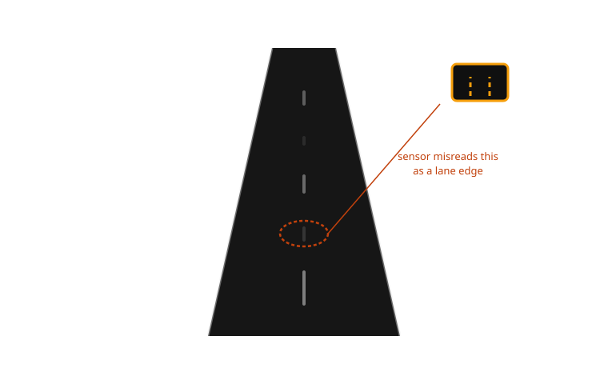
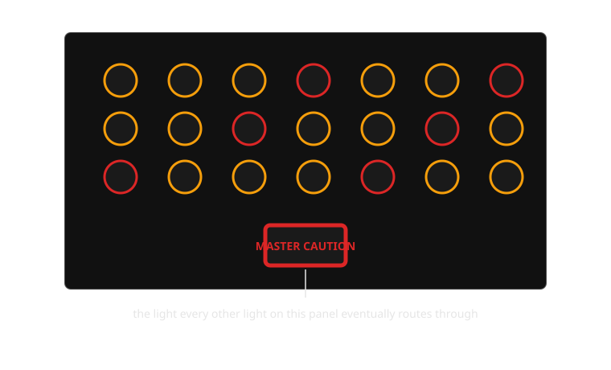

{/* _class: impact */}

# Week 10

## Cry wolf: trust and alarm fatigue

What happens to a warning system's credibility the tenth time it's wrong?

```notes
Open cold, no slide 2 yet visible: ask how many people have ridden in a car
that beeped at them for something that wasn't actually a problem. Nearly
every hand goes up. Ask what they did about it by the third or fourth time.
That answer is the whole week.
```

---

## Learning objectives

By the end of this week you should be able to:

- **explain why** a false-alarm rate is a chosen tuning parameter of an
  ADAS system, not a defect to be engineered away
- **trace** the alarm-fatigue research lineage from 1970s–80s aviation
  cockpit studies to present-day automotive ADAS research
- **identify** a documented, real example of drivers habituating to or
  disabling a specific driver-assistance feature, and state why
- **compare** a high-sensitivity and a high-specificity tuning of the same
  ADAS feature and state the trade-off each one implies for the driver
- **describe** the alarm-fatigue feedback loop as a cycle that repeats and
  degrades, not a single one-way failure

---

## Opening example: the commute that cries wolf

A driver takes the same route to work every day. Halfway along it, a stretch
of resurfaced road has lane markings that haven't been repainted yet — thin,
inconsistent, partly worn away by a winter of traffic. Every morning, in
that same stretch, the lane-departure warning chimes and the wheel gives a
small corrective tug, even though the driver hasn't drifted anywhere.

By the second week of this commute, the driver reaches for the button that
turns lane-keeping off before they even get to that stretch of road — not
because the feature is worthless, but because in this one place, on this one
drive, it has never once been right.

---

## Opening example: what the car is trying to say, and why this matters

The car isn't malfunctioning in the usual sense. Its sensor is reading the
road exactly as instructed and concluding, reasonably from the pixels it
has, that the car has crossed a line it hasn't repainted. The alert is
doing its job as specified; the specification is what's failing in this
one, entirely predictable, condition.

This matters because the same system, on the same drive, might one day
detect a real departure — a moment of drowsiness, a genuine drift into the
next lane. If the driver has already trained themselves to switch it off
before reaching that stretch of road, the one time it would have been right
is the one time it isn't running at all.

```notes
This opening example is deliberately mundane — no crash, no near-miss, just
a worn road. That's the point: alarm fatigue doesn't require a dramatic
failure to take hold, just repetition of an ordinary one.
```

---

## From a fixed message to a running average

Earlier weeks treated an alert as carrying a stable meaning: this colour
means this urgency, this chime means this fault. What that framing leaves
out is that a driver's *response* to an alert isn't fixed at all — it's an
accumulated judgement built from every previous time that exact alert fired
and what actually happened afterward.

The alert's meaning hasn't changed between the first chime and the tenth.
What has changed is the driver's internal estimate of how much that meaning
can be trusted. Trust, here, behaves like a resource that gets spent by
every false alarm and only slowly rebuilt — if it rebuilds at all.

---

## The four outcomes every alert can produce

Alarm-fatigue research borrows a simple grid from signal detection theory,
and it's worth having explicitly before the case study, because every
example this week is a point on this grid:

| Aspect | Hazard actually present | Hazard not present |
|---|---|---|
| **Alert fires** | Hit — correct warning | False alarm |
| **Alert stays silent** | Miss — dangerous silence | Correct rejection |

A system tuned to minimise misses will necessarily produce more false
alarms, because it is casting a wider net over ambiguous cases. There is no
tuning that eliminates both at once — every design choice this week
discusses is a choice about where on this grid a manufacturer is willing to
sit.

---

## Comparison: two lane-keeping philosophies, same underlying hazard

Manufacturers have made visibly different bets about where on that grid to
sit for the same feature. A system tuned toward frequent, firm correction —
common in several BMW and Mercedes-Benz lane-keeping implementations in
their more assertive settings — intervenes readily, including in ambiguous
cases, on the theory that a firm nudge costs little even when unnecessary.
Tesla's Autopilot lane-keeping, by contrast, has historically been tuned
toward a lighter touch that intervenes less readily, on the theory that
frequent unnecessary correction erodes trust faster than an occasional late
one costs safety.

Neither is simply "correct" — they're different answers to the same
signal-detection trade-off, and each produces a different long-run
relationship between the driver and the system.

```comment
This is the "direct comparison between two interface approaches" required
within the core-content section, kept separate from the dedicated,
more clinical sensitivity/specificity comparison table later in the deck —
this one is about design philosophy, that one is about the raw numbers.
```

---

## Where this was studied first: the cockpit, not the car

Alarm fatigue is not a new discovery prompted by ADAS — it is an old finding
being re-applied. Commercial and military aviation spent the 1970s and 80s
studying cockpit alarm systems after a run of incidents in which crews were
found to have silenced, ignored, or ceased responding to an alarm that later
turned out to be correct, following a string of prior alarms that hadn't
been.

The finding that came out of that research programme was blunt: as an
alarm's positive predictive value falls — the more often it turns out to be
wrong — trained, professional operators reliably slow their response to it,
and eventually stop responding altogether. This wasn't attributed to
carelessness or poor training. It held across highly experienced crews.

---

## From the cockpit to the dashboard

The mechanism aviation identified doesn't require a cockpit, a pilot's
licence, or split-second stakes — it requires only a signal that fires more
often than it's informative, observed by a human who has to decide, each
time, how much attention it's worth. That describes a lane-departure chime
exactly as well as it describes a stall warning.

What's different in the automotive case is exposure: a commercial pilot
encounters a given cockpit alarm rarely across a career. An ordinary driver
with lane-keeping assist can encounter a false lane-departure alert daily,
on the same commute, for years. The mechanism is identical; the automotive
case just compresses the same erosion of trust into a much shorter
timeline.

---

## The mechanism of habituation, step by step

Habituation isn't a single event — it's a gradual recalibration, and it
follows a fairly consistent pattern in the human-factors literature:

1. An alert fires and the driver checks the road — cost paid: attention
2. The check finds nothing — the alert is filed, unconsciously, as "that
   one" being slightly less reliable than believed a moment ago
3. Repeat across enough occurrences and the checking step itself starts
   getting skipped, because it has stopped predicting anything useful
4. Response, when it still happens at all, slows — reaction time to the
   same alert measurably increases as trust in it falls
5. Eventually the driver either ignores the alert reflexively or disables
   the feature outright, ending the cost of checking altogether

None of these steps requires the driver to consciously decide "I no longer
trust this." The recalibration happens below that level.

---



*The road didn't do anything unusual. That's exactly why this kind of false alarm is so hard to design out.*

---

## Real example: Honda Sensing and the faded-marking problem

Honda's Sensing suite, standard across much of its US and other-market
lineups since the mid-2010s, relies on a forward camera to read lane
markings for its lane-keeping assist. It is a useful example precisely
because it is so widely deployed: owner forums and consumer complaint
filings across those years contain a recurring, specific pattern — the
system alerting or gently steering on stretches of road with worn,
patched, or temporary construction-zone markings, prompting a documented
subset of owners to describe turning the feature off altogether rather than
tolerate the repeated correction. The complaint isn't that the sensor
malfunctions; it's that it does exactly what it was built to do, on exactly
the input that defeats it.

---

## Real example: Tesla Autopilot and phantom braking

Tesla's forward-collision and automatic-emergency-braking systems have
drawn a specific, well-documented complaint pattern of their own: "phantom
braking," sudden hard braking triggered with no vehicle, pedestrian, or
obstacle actually present, frequently reported around overpasses, shadows,
or oncoming vehicles in an adjacent lane. This is a forward-collision
warning's false alarm taken to its most consequential form — a false
positive that isn't just a chime the driver can learn to discount, but an
actual deceleration event other traffic has to react to. It sharpens this
week's point: a false alarm's cost isn't only "the driver stops trusting
it" — it can be a cost paid immediately, by other road users, at the moment
it fires.

---

## Process: the alarm-fatigue feedback loop

This is not a one-way failure that happens once — it is a loop that
compounds with every pass:

1. **System issues an alert**
2. **Alert turns out to be a false positive** (worn markings, a phantom
   radar return, a stopped car on an overpass)
3. **Driver's trust in that specific alert type decreases slightly**
4. **Steps 1–3 repeat**, often dozens of times, across days or weeks
5. **Driver begins to delay their response, tune the alert out, or disable
   it entirely**
6. **On the occasion the alert is correct**, the driver's response is
   slower than it would have been, or absent — because step 5 has already
   happened
7. Loop back to step 1: the system keeps firing on the same schedule
   regardless of where the driver's trust now sits, unless it's been
   disabled — in which case the loop has ended, but so has the warning

```notes
Draw this as a literal circle on the board if presenting live — arrows from
1→2→3→4→5→6 and then back to 1. The point students most often miss is that
the system side of the loop never changes; only the human side degrades.
That asymmetry is the whole mechanism.
```

---

## Case study: the interface as originally designed

Lane-departure and forward-collision warnings were designed, and are mostly
still built, as binary alerts: a threshold is crossed (lateral position,
closing distance, time-to-collision) and the system fires at one fixed
intensity, regardless of how confident the underlying sensor reading
actually was. A near-certain imminent collision and a borderline,
ambiguous read both produce the identical chime, tug, or flash. The design
intent was reasonable and legible: keep the interface simple, keep the
driver's decision simple — alert means "look now."

---

## Case study: strengths, weaknesses, and consequences

The strength of a binary alert is genuine — it's unambiguous and fast to
learn, with nothing for the driver to interpret about degree. The weakness
is exactly what this week has been building toward: because the alert
carries no confidence information, a low-confidence false positive and a
high-confidence correct warning look and feel identical to the driver, and
get folded into the same running trust estimate. Every faded-marking false
alarm degrades the same trust account that a genuine, high-confidence
warning will later need to draw on. The consequence isn't abstract — it
shows up as documented disabling behaviour, as with Honda Sensing above,
and as slower or absent response to the alert that does turn out to matter.

---

## Case study: toward a synthesis

A binary alert isn't the only option a confidence-scored sensor reading
allows. Several current systems have started moving toward graded alerting
— a soft, low-intensity cue for a borderline or low-confidence read, and the
full chime-plus-intervention reserved for high-confidence cases — rather
than asking one fixed-intensity alert to represent every confidence level
identically. This doesn't eliminate false alarms; sensors will always
misread some inputs. What it changes is the cost of being wrong at low
confidence, and it preserves more of the driver's trust for the alerts that
actually need it.

---



*Aviation studied alarm fatigue here first — long before a lane-departure chime existed to inherit the same problem.*

---

## Comparison: tuning the same feature toward sensitivity or specificity

Take one feature — forward-collision warning — and hold the hazard fixed.
The manufacturer still has to choose where on the sensitivity/specificity
trade-off to sit:

| Aspect | High-sensitivity tuning | High-specificity tuning |
|---|---|---|
| False-positive rate | Higher — fires on ambiguous or borderline cases | Lower — fires mainly on clear, high-confidence cases |
| Missed-detection rate | Lower — few genuine hazards slip through | Higher — some genuine hazards fall below the firing threshold |
| Driver's trust over time | Erodes faster, more disabling behaviour | Better preserved, but slower to react at the true edge cases |
| Failure mode when wrong | Cry-wolf effect: driver stops responding | Silent gap: system simply doesn't warn in time |

Neither column is the safe one — each converts the same underlying
uncertainty into a different kind of harm.

---

## Classroom activity: audit a real ADAS complaint thread

**Task:** In pairs, find one real owner-forum thread, consumer complaint
filing, or published news report describing a driver disabling or
distrusting a lane-departure, forward-collision, or lane-keeping feature
(Honda Sensing and Tesla Autopilot are two starting points, but any
documented case counts).

**Inspect:** what specific road, sensor, or lighting condition triggered
the false alarm being described, and how many times the driver says it
happened before they disabled the feature.

**Discuss:**

1. Does the complaint describe a sensitivity problem (too many false
   alarms) or a specificity problem (a missed or late detection)?
2. What would a graded, confidence-scored version of this alert have done
   differently in the specific case described?
3. Is disabling the feature entirely a reasonable response, given what this
   week's mechanism predicts — or is there a narrower fix the driver didn't
   have access to?

```notes
Sample direction: most found threads describe a sensitivity problem —
repeated false lane-departure or FCW alerts on a specific stretch of road or
condition (overpasses, faded paint, tight urban curves) rather than a missed
detection, simply because missed detections are underreported by drivers
who never realise a warning should have fired. Push groups toward question 3
— "disable entirely" versus "narrower fix" is the crux of the whole week,
and most groups will land on wanting a context-aware or location-aware
threshold rather than a single global on/off switch.
```

---


*The complaint is rarely 'it was wrong once' — it's almost always 'it was wrong enough times that I stopped trusting it.'*

---

## Mini knowledge check

1. Why is a false-alarm rate better described as a tuning choice than as a
   defect?
2. Name one specific, documented automotive example from this deck of
   drivers habituating to or disabling an ADAS alert, and the condition
   that triggered it.
3. Scenario: a forward-collision warning has a high positive predictive
   value in daytime but a much lower one at dusk, due to sensor glare. What
   does this week's mechanism predict will happen to driver trust in that
   alert specifically at dusk, over time?
4. What is the key difference between a binary alert and a graded,
   confidence-scored alert, and why does that difference matter for trust?

```notes
1. It's a direct output of where a sensitivity/specificity threshold is
   set — tightening one side of the grid always loosens the other; there's
   no threshold that removes both false alarms and missed detections.
2. Honda Sensing on faded/worn lane markings, or Tesla Autopilot phantom
   braking around overpasses/shadows — either is acceptable if the student
   states the specific triggering condition.
3. Trust in that alert specifically at dusk should erode faster than trust
   in the same alert during the day, because the driver's running estimate
   of reliability is condition-specific, not global — this previews the
   "same alert, different context" idea week 11 extends to regulation.
4. A binary alert fires identically regardless of the sensor's confidence;
   a graded alert scales its intensity to confidence, so a low-confidence
   false positive costs less trust than a high-confidence one would.
```

---

## Summary

- An alert's meaning is fixed, but a driver's *response* to it is a running
  average of every prior time it fired — trust is a resource, not a
  constant
- A system's false-alarm rate is a chosen tuning parameter (the
  sensitivity/specificity trade-off), not simply a bug to be removed
- Aviation identified the mechanism first: cockpit alarm research from the
  1970s–80s showed trained operators reliably stop responding to alarms
  with low positive predictive value, regardless of training
- Documented automotive cases — Honda Sensing on faded markings, Tesla
  phantom braking — show the identical mechanism operating on a much
  shorter, more frequent exposure timeline than aviation ever had
- The feedback loop is cyclical, not one-way: it keeps compounding until
  the driver disables the alert, at which point it can no longer help even
  when it would have been right

---

## Bridge to week 11: the same alert, a different threshold

This week treated the sensitivity/specificity threshold as a manufacturer's
design choice. It isn't only that — it's also a regulatory one. Euro NCAP,
NHTSA and Japanese regulators each set different requirements for when a
lane-departure or forward-collision system is required to warn at all, and
how aggressively. The same physical car, sold in three markets, can ship
with three different thresholds for "urgent enough to say something" —
which means the exact cry-wolf dynamic this week described is not a fixed
property of a feature, but something regulators are, in effect, choosing on
the driver's behalf, differently, depending on where the car is sold.

```notes
Close by returning to the sensitivity/specificity table from earlier in the
deck and asking: who actually gets to choose which column a given market
sits in? The manufacturer tunes it, but the regulator sets the floor — and
that floor is what week 11 pulls apart.
```

---

{/* _class: impact */}

## The tenth time it's wrong

A warning system doesn't lose credibility all at once. It loses it one
false alarm at a time, silently, until the eleventh time — the time it's
right — arrives to find no one still listening.
