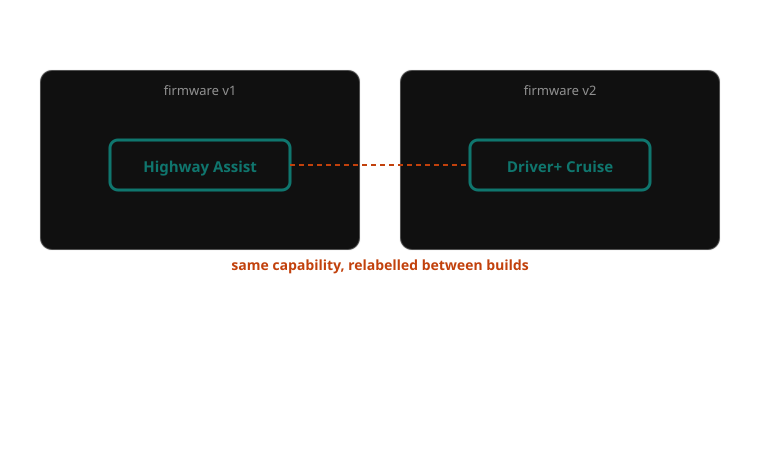
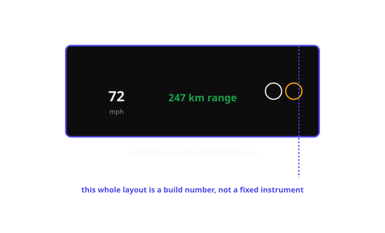
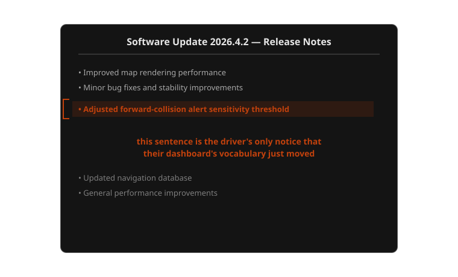

{/* _class: impact */}

# Week 12

## The next dashboard

If you were inventing this vocabulary today, with no legacy dashboard to
imitate, what would you keep, and what would you throw out?

```notes
Last lecture of the course. Don't open with logistics — open with the
question itself, cold, and let the room sit with it for a moment before
moving to objectives. Everything after this slide is in service of the
assessment due Wednesday, but say that once, near the end, not now.
```

---

## Learning objectives

By the end of this week you should be able to:

- **identify** which channels a software-defined dashboard can change after
  the vehicle has already been sold, versus which stay fixed at manufacture
- **explain why** an over-the-air alert change can silently invalidate a
  driver's already-learned vocabulary, using at least one specific week's
  material as evidence
- **compare** a factory-fixed dashboard vocabulary against a software-
  defined, updatable one across consistency, trust and accountability
- **synthesise** material from across the whole semester — needles, lights,
  icons, colour, sound, text, HUD, driver-assistance alerts, trust, and
  regulation — into a single coherent design position
- **propose** a principle for how a manufacturer should disclose an alert-
  vocabulary change to drivers when it happens

---

## Opening example: the chime that changed overnight

A Tesla owner's forward-collision warning has always sounded a particular
way. One week, after a routine overnight software update, it sounds
different — earlier, at a slightly greater following distance, with a
subtly altered tone. Nothing under the hood changed: same radar, same
camera, same car. The release notes, if the owner reads them at all, say
something like "improved forward collision warning sensitivity." The driver
was not asked, and in many cases was not told in any way they'd actually
notice before it happened on the road.

---

## Why this example carries the week

Every previous week in this course treated a dashboard element as something
a driver learns once and can rely on for the life of the car — a red light
means the same thing in year one and year ten. This example breaks that
premise cleanly: the *car itself* changed its own vocabulary, on its own
schedule, without the vehicle changing hardware at all. That is a genuinely
new situation. Week 1 already flagged Tesla's software-first cluster as a
preview of this; this week is where the preview becomes the whole subject.

```notes
Push the room on the word "silently" — ask whether they'd have noticed a
change like this in their own car, or a rental, without being told. Most
will admit they wouldn't. That's the mechanism, not a hypothetical.
```

---

## What actually became different

Nothing about *what* a forward-collision warning is for changed. What
changed is entirely underneath the surface a driver reads:

- the **threshold** at which the alert fires
- the **timing** of the alert relative to the hazard
- possibly the **tone or pattern** of the chime itself
- all of it, delivered without a factory recall, a dealer visit, or a new
  model year — the traditional occasions on which a car's behaviour used to
  visibly change

The dashboard's *appearance* — the icon, its position, its colour — can
stay pixel-for-pixel identical while its *meaning* moves underneath it.

---

## Which channels get more fragile once they're software

Not every channel is affected equally by this shift. Some become *more
fragile* precisely because software makes them cheap to change:

- **week 5's colour convention** (red/amber/green) is fragile because the
  boundary between amber and red is now a tunable parameter, not a wired
  bulb — a manufacturer can move it without anyone approving the move
- **week 10's alarm-fatigue calibration** is fragile because a driver's
  learned false-alarm tolerance is invalidated the moment the underlying
  detection threshold is retuned by update, without the driver's trust
  being retuned alongside it
- **week 9's driver-assistance narration** is fragile because the alert's
  *justification* — why the car intervened — can change even when its
  *appearance* doesn't

---

## Which channels get more flexible, for the same reason

The same shift that makes some channels fragile makes others genuinely
better than they could be in a factory-fixed car:

- **week 3's idiot light**, once a permanent hardware compromise, can now be
  replaced with an actual explanation on a display, after the fact, at zero
  manufacturing cost — the excuse that justified vagueness in the 1960s no
  longer applies to a 2020s software-defined cluster
- **week 7's text-on-dashboard translation problem** can be fixed
  retroactively — a mistranslated warning string is a bug that ships an
  update, not a recall
- **week 11's regulatory divergence** becomes a rollout schedule rather than
  a permanent manufacturing variant — a compliance fix can, in principle,
  reach every market's fleet without a different production line

---

## Direct comparison: a chime, fixed vs. updatable

Week 6 covered the mandated seatbelt-chime escalation and Tesla's
comparatively minimal chime set as two design philosophies. Put them next to
this week's subject directly:

| Aspect | Mandated seatbelt chime (fixed) | Tesla-style software chime (updatable) |
|---|---|---|
| Who can change it | Only a regulator, via a rule change | The manufacturer, at will |
| How a driver learns of a change | A new model year, visibly different | Possibly never, if release notes go unread |
| Consistency across the fleet | Every unit of a model year, identical | Depends which update each car has received |
| Driver recourse if it's wrong | None until the next model year | Reported as feedback, fixed on the manufacturer's timeline |

The mandated chime is inflexible by design — that inflexibility is also the
only reason every driver of that model year can trust it means the same
thing every time.

---

## Real example: BMW's subscription-gated features

BMW's now-abandoned experiment charging a subscription for heated seats
(and, more relevantly here, for certain driver-assistance feature tiers) is
useful for this week because it shows the software-defined dashboard isn't
only a safety story — it's also a business one. The same over-the-air
channel that can fix a mistranslated warning string (week 7) can also gate
an already-installed safety feature behind a paywall, changing what the
dashboard is *allowed* to tell a driver depending on a billing decision, not
a hazard.

---

## Real example: Rivian's renamed and re-presented alerts

Rivian's R1T and R1S have, across firmware releases, altered how driver-
assistance features are named and presented on the driver display — not
just tuning a threshold, but changing the vocabulary itself, the words and
icons a returning driver has to re-recognise. It's useful alongside Tesla
because it shows this isn't a single-manufacturer quirk: it's a structural
consequence of building the entire cluster in software, and it happens
across otherwise very different companies.



*The feature didn't change. The word for it did.*

---

## Real example: Volvo, still the throughline

Volvo's telltale colour discipline (week 1), its City Safety alert that
narrates a decision (week 9), and its driver-fatigue text messages (week 7)
have all appeared already this semester as examples of a manufacturer
choosing restraint and consistency. It's worth asking directly, as a
software-defined dashboard becomes the industry default: does a
manufacturer with that track record earn more licence to change a driver's
vocabulary after the sale, or does the size of the update channel mean the
question of trust doesn't actually depend on a manufacturer's past
behaviour at all?

```notes
No right answer expected here — this is meant to seed argument, not close
it. If the room splits, that's the correct outcome; hold it open into the
knowledge-check discussion later rather than resolving it now.
```

---

## The process: how a driver's vocabulary changes without them asking

A software-defined alert doesn't change randomly — it follows a real
pipeline, worth naming precisely because every stage is a point where a
human decision, not a technical necessity, determines what the driver
eventually sees:

1. **Signal from the field** — telemetry, owner complaints, or incident data
   flags a problem or an opportunity in an existing alert
2. **A new design or threshold is proposed** — internally, by an engineering
   or UX team, not by the driver who will receive it
3. **Validation and testing** — simulation, closed-course testing, sometimes
   a staged rollout to a subset of the fleet
4. **Pushed as an over-the-air update** — delivered to some or all vehicles,
   on the manufacturer's schedule
5. **The driver's dashboard vocabulary changes** — without the driver
   requesting it, and not always with a disclosure they'd actually notice
6. **The driver has to relearn** part of a language they believed they
   already knew — usually by trial and error, on the road

---

## Where this pipeline differs from every earlier week

In every earlier week's material, stage 5 and stage 6 above didn't exist as
separate events — a driver learned a dashboard's vocabulary once, roughly at
purchase, and that vocabulary was the same vocabulary for the life of the
car (week 1's Jaguar E-Type is the extreme case: no telltales at all to
relearn, because none were ever added). The software-defined pipeline
inserts a *recurring* relearning cost that earlier weeks never had to
budget for, and nothing in the pipeline above requires the manufacturer to
tell the driver it happened.

```comment
This is the load-bearing slide of the deck, the software-era equivalent of
week 1's six-stage alert process and week 7's fault-to-sentence pipeline.
Keep it visible while narrating the "where this differs" slide that follows
it — the two should be read as one unit.
```

---

## Case study, part 1: the original — an alert vocabulary that lives in software

Tesla's Model 3 and Model Y ship with no separate driver instrument
cluster — speed, range, and every warning live on the centre touchscreen,
rendered by software that updates on Tesla's own schedule, sometimes
overnight. **Design intent:** treat the entire cluster as a maintained
product, not a fixed instrument — fix a bad design decision for the whole
fleet without a recall, and add capability (new alert types, refined
thresholds) that a 1961 or even a 2004 dashboard had no path to ever
receiving. **Strength:** a genuinely miscalibrated alert can be corrected in
days for every vehicle that has ever shipped, something no earlier week's
case study could do at all.

---

## Case study, part 2: the weakness — a vocabulary the driver didn't agree to

Rivian's comparable approach — a dedicated driver display, still software-
rendered, still updated post-sale — shares the same structural weakness as
Tesla's: the driver's mental model of their own dashboard is invalidated on
the manufacturer's timeline, not the driver's. Week 10 established that
trust in a warning system is a running average built from every past
encounter with it; an OTA update resets part of that average without
resetting the driver's confidence that they still know how to read it. A
driver who has correctly, patiently, learned to trust an alert's threshold
can be wrong about that threshold the very next morning, through no fault of
their own attention or judgement.

---

## Case study, part 3: consequences and a synthesis

The consequence is a specific, nameable cost this course hasn't had to
name until now: **relearning cost imposed without consent.** Week 7 already
established that a driver can't be expected to notice a meaning has changed
just from looking at an unchanged icon — that finding applies with full
force here, except the "meaning" in question isn't a translation choice
made once, it's a threshold that can move again next month. **Suggested
synthesis, carried into the final assessment:** any OTA change to an alert's
trigger, threshold, or presentation should be disclosed to the driver, in
plain language, at the point it takes effect — not buried in a changelog —
because disclosure is the only mechanism available in a software-defined
vehicle that does the job a fixed factory dashboard did automatically, for
free, just by never changing.



*The instrument cluster as a version number: what you're reading may not be what next month's owner reads.*

---

## Comparison: fixed-at-the-factory vs. software-defined vocabulary

| Dimension | Fixed at the factory | Software-defined, updatable |
|---|---|---|
| Consistency for the life of the car | Guaranteed — same meaning, year one to year ten | Not guaranteed — meaning can shift with any update |
| Driver trust, once earned | Stable; earned once, holds | Has to be re-earned after every meaningful change |
| Design accountability for a bad alert | Visible — a recall, a known model-year defect | Diffuse — a quiet patch, easy to ship without scrutiny |
| Speed of fixing a genuine flaw | Slow — waits for the next model year | Fast — days, for the whole fleet at once |
| Who decides the vocabulary, and when | Fixed once, at design time, by an engineering team | Decided repeatedly, post-sale, on the manufacturer's own schedule |

Neither column is simply better — the table is the whole argument for this
week: speed of correction and stability of meaning are in direct tension,
and a software-defined dashboard has only picked one side of that trade.

---

## The disclosure, in full



*The whole disclosure, for a change to a language you already trusted.*

---

## Exercise: pressure-test your own vocabulary against an update

Final classroom preparation before the capstone submission. Working from the
vehicle and alert vocabulary you're building for *The Instrument Cluster
You'd Trust*:

1. Pick one alert from your own vocabulary and imagine you, as the
   manufacturer, need to change its threshold six months after sale, based
   on field data showing it fires too often
2. Sketch how that change would be disclosed to the driver — what they'd
   see, and when
3. Identify which of your other alerts would be *most* damaging to change
   silently, and which would be *least* damaging, and say why

Discuss: does your vehicle's context (a delivery van, a motorcycle, a
low-speed shuttle) change how much relearning cost a driver can absorb
safely?

```notes
Sample discussion direction: a commercial delivery driver operating the
same vehicle for eight hours a day, five days a week, can absorb a
relearning cost faster than an occasional weekend driver of a shared
vehicle — frequency of exposure is itself a design variable. A good answer
treats disclosure design as scaled to the driver's exposure pattern, not
as a single universal notice format. There is no single correct sketch for
step 2; look for whether students propose disclosure that happens *before
or at* the point of effect, not buried in a changelog after the fact — that
distinction is the whole point of the case-study synthesis.
```

---

## Mini knowledge check — the whole semester

1. Name one channel (needle, light, icon, colour, sound, text, HUD,
   driver-assistance alert) that becomes *more fragile* once it lives in
   updatable software, and explain why, referencing the week it came from.
2. A manufacturer silently retunes a forward-collision warning's threshold
   by OTA update. Using week 10's terms, what happens to the driver's trust
   calibration, and why doesn't the driver's attention or judgement explain
   the result?
3. Compare the Jaguar E-Type (week 1) and a Tesla Model 3/Y directly: which
   one guarantees its dashboard means the same thing on day one and day
   one-thousand, and what does that guarantee cost it?
4. Propose one concrete rule a regulator or manufacturer could adopt to make
   OTA alert changes fair to drivers, drawing on at least two weeks' worth
   of material.

```notes
1. Any defensible answer naming the correct week and a real mechanism —
   e.g. colour (week 5), because the amber/red boundary becomes a tunable
   parameter with no wired constraint left; or trust calibration (week 10),
   because a retuned threshold invalidates a learned false-alarm rate.
2. The driver's trust was built as a running average against a threshold
   that no longer exists — the mismatch is the manufacturer's change, not a
   lapse in the driver's attention or judgement, which is exactly the
   alarm-fatigue mechanism from week 10 applied to a moving target instead
   of a fixed one.
3. The E-Type guarantees permanence — no telltales at all, so nothing to
   relearn, ever — at the cost of never being able to report a fault type
   nobody planned for in 1961; Tesla can report and correct almost
   anything, at the cost of that guarantee.
4. Strong answers combine a disclosure requirement (case-study synthesis,
   this week) with either week 7's plain-language standard (disclose in a
   sentence a driver can read, not a technical changelog) or week 11's
   regulatory-variation material (a rule that a change must be disclosed
   identically regardless of market).
```

---

## Summary: the whole course, in five ideas

- A dashboard is a language, not a neutral report of measurements (week 1)
  — and like any language, it can drift, be relearned, or be changed by
  someone other than its speaker
- Every channel this course studied — needle, light, icon, colour, sound,
  text, HUD, driver-assistance alert — is a trade-off, never a free upgrade
  over what came before it
- Trust in a warning is a running average built over time (week 10), which
  means it can be spent by a false alarm and reset, without consent, by an
  update
- Regulation (week 11) and manufacturing cost (weeks 3 and 7) have always
  been the forces holding a dashboard's vocabulary stable — software removes
  both constraints at once, for better and worse
- The question this course has actually been asking since week 1 was never
  "what does this light mean," but "who gets to decide what it means, and
  when do they get to change their mind"

---

{/* _class: impact */}

## A dashboard is a language

A car uses it to talk to a human under time pressure. Every needle, light,
icon, colour, chime, sentence and windscreen graphic this semester has been
one sentence in that language.

Now go design one you'd trust. *The Instrument Cluster You'd Trust* is due
this Wednesday, 14 May.

```notes
Close here, not with a recap slide beyond the summary already given. Let
the silence after "now go design one" sit for a second before moving to
logistics about the submission if anyone asks. This is the last slide of
the course.
```
